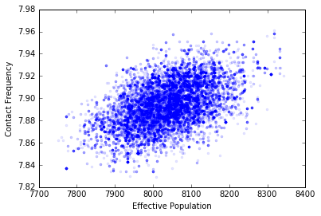

Fitting a model with Markov Chain Monte Carlo
=============================================

Markov Chain Monte Carlo (MCMC) is a way to infer a distribution of
model parameters, given that the measurements of the output of the model
are influenced by some tractable random process. In this case, performs
something akin to the opposite of what a standard Monte Carlo simulation
will do. Instead of starting with distributions for the parameters of a
model and using them to calculate a distribution (usually related to
uncertainty) in the output of the simulation, we start with a
distribution of that output and look for input distributions.

Ingredients
-----------

For this analysis we'll introduce the python package
`PyMC <https://pymc-devs.github.io/pymc/README.html>`__ which implements
MCMC algorithms for us. Another project which performs similar
calculations is `PyStan <https://pystan.readthedocs.org/en/latest/>`__.

.. code:: python

    %pylab inline
    import pysd
    import pymc
    import pandas as pd

.. parsed-literal::

    Populating the interactive namespace from numpy and matplotlib

For this example, we'll revisit the ebola case, only assuming that our
data has some noise, and we'll use MCMC to estimate distributions for
the parameters for the model. For a more detailed description of this
model and the dataset see the recipe `Fitting with
Optimization <http://pysd-cookbook.readthedocs.org/en/latest/analyses/fitting/Fitting_with_Optimization.html>`__.

We'll assume that the model simulates an underlying process of disease
propagation, but that the data is noisy - perhaps it represents
admittance rates at a hospital, and so will be missing some cases, and
may include some false positives through misdiagnosis.

.. image:: ../../../source/models/SI Model/SI Model.png
   :width: 600 px

.. code:: python

    model = pysd.read_vensim('../../models/SI Model/SI Model.mdl')

.. code:: python

    data = pd.read_csv('../../data/Ebola/Ebola_in_SL_Data.csv', index_col='Weeks')
    data.plot();

.. image:: MCMC_for_fitting_models_files/MCMC_for_fitting_models_5_0.png

Recipe
------

Step 1: Establish prior distributions for the input parameters
^^^^^^^^^^^^^^^^^^^^^^^^^^^^^^^^^^^^^^^^^^^^^^^^^^^^^^^^^^^^^^

Our first step is to establish prior distributions for the parameters
for which we will be trying to infer posterior distributions. As in the
optimization case, we'll modify the effective population and the contact
frequency. In real epidemiological modeling, we'd have a more complex
model, and we'd have some information about the population, etc. but
this makes for a relatively tight example.

.. code:: python

    population = pymc.Uniform('total_population', lower=2, upper=50000, value=10000)
    contact_frequency = pymc.Exponential('contact_frequency', beta=5, value=5)

Step 2: Perform the simulation
^^^^^^^^^^^^^^^^^^^^^^^^^^^^^^

We now need to define a function that will run the model given a draw
from the input distributions, and return the values that we will take as
those of the fundamental underlying phenomena, before measurement noise
is included.

.. code:: python

    @pymc.deterministic
    def sim(population=population, contact_frequency=contact_frequency):
        result = model.run(params={'total_population':population,
                                   'contact_frequency':contact_frequency},
                           return_columns=['infection_rate'],
                           return_timestamps=list(data.index.values))
        return result['infection_rate'].values

Step 3: Include noise terms
^^^^^^^^^^^^^^^^^^^^^^^^^^^

There are several ways we could include noise. If we expected no false
positives, we could use a Binomial distribution, such that of ``n``
possible cases that could be reported, only a fraction ``p`` would be
reported, and other cases missed. If we only want to model false
positives, we could assume that there was an average rate of false
positives, with the data following a poisson distribution. The full rate
would be the sum of these two processes.

For now, however, we'll simplify the analysis by only looking at the
Poisson noise component. The mean of the poisson process will be the
results of our simulation.

This is where we include our measured data into the model. PyMC will
know how to calculate the log likelihood of seeing the observed data
given the assumption that the simulation result represents the
underlying process, subject to Poisson noise.

.. code:: python

    admittances = pymc.Poisson('admittances', mu=sim,
                               value=data['New Reported Cases'], observed=True)

Step 4: Perform the MCMC Sampling
^^^^^^^^^^^^^^^^^^^^^^^^^^^^^^^^^

Now that we have set up the problem for PyMC, we need only to run the
MCMC sampler. What this will do, essentially, is take a trial set of
points from our prior distribution, simulate the model, and evaluate the
likelihood of the data given those input parameters, the simulation
model, and the noise distribution. It will then use bayes law to decide
whether to keep the trial points or throw them away. It will then choose
a new set of points and start over. (There is a lot more cleverness
happening than this, of course. If you want to know how it works, I
recommend `Bayesian Methods for
Hackers <http://camdavidsonpilon.github.io/Probabilistic-Programming-and-Bayesian-Methods-for-Hackers/>`__.

First we assemble the various pieces of the data flow that we built up
into a model that pymc can recognize, and instantiate a sampler ``MCMC``
to run the algorithm for us.

Then we'll ask the MCMC algorithm to run until it has kept 20000 points.
We'll throw out the first 1000 of these, as they are likely to be biased
towards the initial values we set up and not representative of the
overall distribution.

.. code:: python

    mcmdl = pymc.Model([population, contact_frequency, sim, admittances])
    mcmc = pymc.MCMC(mcmdl)
    mcmc.sample(20000,1000)

.. parsed-literal::

     [-----------------100%-----------------] 20000 of 20000 complete in 67.1 sec

Step 5: Look at the distribution
^^^^^^^^^^^^^^^^^^^^^^^^^^^^^^^^

We can now evaluate the results by looking at the series of points we
'kept'. These are stored as traces within the population and contact
frequency objects we built earlier.

.. code:: python

    plt.figure(figsize=(6,2))
    plt.hist(population.trace[:], bins=100, histtype='stepfilled', normed=True, alpha=.6);
    plt.title('Fit distribution for the population parameter');

.. code:: python

    plt.figure(figsize=(6,2))
    plt.hist(contact_frequency.trace[:], bins=100, histtype='stepfilled', normed=True, alpha=.6);
    plt.title('Fit distribution for the contact frequency parameter');

.. image:: MCMC_for_fitting_models_files/MCMC_for_fitting_models_19_0.png

.. code:: python

    plt.figure(figsize=(6,1))
    plt.hist(contact_frequency.trace[:], bins=100, histtype='stepfilled', normed=True, alpha=.6);
    plt.yticks([])
    plt.title('Fit distribution for the characteristic time parameter');
    plt.xlabel('Minutes')

.. parsed-literal::

    <matplotlib.text.Text at 0x10cf40350>

.. image:: MCMC_for_fitting_models_files/MCMC_for_fitting_models_20_1.png

Step 6: Understand the correlation between our parameter distributions
^^^^^^^^^^^^^^^^^^^^^^^^^^^^^^^^^^^^^^^^^^^^^^^^^^^^^^^^^^^^^^^^^^^^^^

PyMC has calculated for us the input distributions for the parameters we
have based upon our data. This isn't the whole story, however, as these
values are not independent of one another. We can see by plotting them
against one another that there is correlation:

.. code:: python

    plt.plot(population.trace[:], contact_frequency.trace[:], '.', alpha=.1)
    plt.xlabel('Effective Population')
    plt.ylabel('Contact Frequency');

.. image:: MCMC_for_fitting_models_files/MCMC_for_fitting_models_22_0.png

If we use these distributions in the future to propagate uncertainty
through the model (say in doing a policy test) we should make sure that
we're including this correlation. The simplest way to do this is just to
use the traces themselves as inputs into a normal Monte Carlo error
propagation calculation, making sure that we use the same index in each
trace for any given run. This will automatically include the correlation
for us. Clever!

Resources:
----------

The analysis in this notebook is inspired by blogt posts by Abraham
Flaxman: -
http://healthyalgorithms.com/2010/11/29/mcmc-in-python-statistical-model-stuck-on-a-stochastic-system-dynamics-model-in-pymc/

-  http://healthyalgorithms.com/2010/10/19/mcmc-in-python-how-to-stick-a-statistical-model-on-a-system-dynamics-model-in-pymc/

A great resource for learning about MCMC is `Bayesian Methods for
Hackers <http://camdavidsonpilon.github.io/Probabilistic-Programming-and-Bayesian-Methods-for-Hackers/>`__
