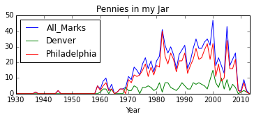
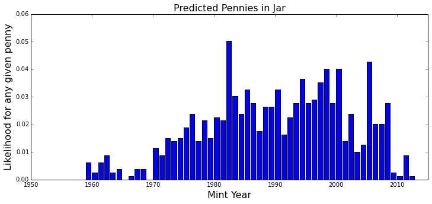

Estimating penny population parameters
======================================

In this example we'll use a System Dynamics model to estimate the total
number of pennies in circulation, based upon the number of pennies
produced in a given year, and the number of pennies in a coin jar.

We start with a simple aging model for pennies, in essence a second
order delay. Pennies are minted each year, and go into a stock of 'post
production' pennies that are distributed to banks, etc. After this they
go into general circulation, from which they are eventually lost.

In this analysis we'll try and infer the parameters for entry into
circulation and loss based upon the number of pennies produced in each
year, and a random sample of pennies taken from circulation over a four
year period. An interesting component of this analysis is that it
requires a whole suite of models (one for each model year) but these
models don't interact with one another except through the sampling and
statistical analysis we perform.

In this demo, we'll use 'pymc', a package for doing markov chain monte
carlo analysis.

.. code:: python

    %pylab inline
    import pandas as pd
    import pysd
    import pymc as mc

.. parsed-literal::

    Populating the interactive namespace from numpy and matplotlib

Load Model
~~~~~~~~~~

To get a sense for how the model behaves, we'll run it with arbitrary
parameter values. We see that pennies enter the 'post production' stock
quickly, and the 'in circulation' stock grows, peaks, and decays as the
pennies get lost.

.. code:: python

    plt.figure(figsize(6,2))
    model = pysd.read_vensim('penny_jar.mdl')
    model.run().plot()
    #model.get_free_parameters()

.. parsed-literal::

    <matplotlib.axes._subplots.AxesSubplot at 0x11733d710>

.. parsed-literal::

    <matplotlib.figure.Figure at 0x1172e6e10>

.. image:: Penny_Jar_files/Penny_Jar_3_2.png

Load Data
~~~~~~~~~

We'll start with some data about the number of coins produced in each
year. We have production data for both the Denver and Philadelphia
mints:

.. code:: python

    production = pd.read_csv('Production_Figures.csv', index_col='Year')
    production.plot()
    plt.title('Pennies Produced Per Year');

.. image:: Penny_Jar_files/Penny_Jar_5_0.png

We'll also use 'data' (pennies) collected in a penny jar over the last
few years

.. code:: python

    coin_counts = pd.read_csv('pennies_in_jar.csv', index_col='Year')
    coin_counts.sort_index().plot()
    plt.title('Pennies in my Jar');

.. code:: python

    coin_counts.sum()

.. parsed-literal::

    All_Marks       1004
    Denver           209
    Philadelphia     795
    dtype: int64

.. code:: python

    plt.figure(figsize=(12,5))
    plt.bar(coin_counts.index, coin_counts['Philadelphia']/sum(coin_counts['Philadelphia']))
    plt.title('Predicted Pennies in Jar', fontsize=16)
    plt.xlabel('Mint Year', fontsize=16)
    plt.ylabel('Likelihood for any given penny', fontsize=16)
    plt.xlim(1950,2015)

.. parsed-literal::

    (1950, 2015)

Set up models
~~~~~~~~~~~~~

We set up a model for each year that pennies are produced, and
initialize them with production data.

We divide the data to put pennies in units of 100,000 to make life
easier for the integrator. This won't matter in the end, as we normalize
the distribution of pennies in circulation before we take our samples.

.. code:: python

    #load a model for each mint year
    models = pd.DataFrame(data=[[year, pysd.read_vensim('penny_jar.mdl')] for year in range(1930,2014)],
                          columns=['Year', 'model'])
    
    models.set_index(keys='Year', drop=False, inplace=True)
    
    #bring in the data on production
    models['Philadelphia Production'] = production['Philadelphia'] / 100000 
    #production will now be in units of hundred-thousands
    
    #bring in the sample data
    models['Philadelphia Samples'] = coin_counts['Philadelphia']
    
    #set the mint year parameters properly
    for index, row in models.iterrows():
        row['model'].set_components({'production_year':row['Year'], 'production_volume':row['Philadelphia Production']})
    
    #drop rows (probably at the end) which are missing data
    models.dropna(inplace=True) 
    
    models.tail(30).head(5)

::

    ---------------------------------------------------------------------------

    TypeError                                 Traceback (most recent call last)

    /Library/Python/2.7/site-packages/IPython/core/formatters.pyc in __call__(self, obj)
        688                 type_pprinters=self.type_printers,
        689                 deferred_pprinters=self.deferred_printers)
    --> 690             printer.pretty(obj)
        691             printer.flush()
        692             return stream.getvalue()

    /Library/Python/2.7/site-packages/IPython/lib/pretty.pyc in pretty(self, obj)
        407                             if callable(meth):
        408                                 return meth(obj, self, cycle)
    --> 409             return _default_pprint(obj, self, cycle)
        410         finally:
        411             self.end_group()

    /Library/Python/2.7/site-packages/IPython/lib/pretty.pyc in _default_pprint(obj, p, cycle)
        527     if _safe_getattr(klass, '__repr__', None) not in _baseclass_reprs:
        528         # A user-provided repr. Find newlines and replace them with p.break_()
    --> 529         _repr_pprint(obj, p, cycle)
        530         return
        531     p.begin_group(1, '<')

    /Library/Python/2.7/site-packages/IPython/lib/pretty.pyc in _repr_pprint(obj, p, cycle)
        709     """A pprint that just redirects to the normal repr function."""
        710     # Find newlines and replace them with p.break_()
    --> 711     output = repr(obj)
        712     for idx,output_line in enumerate(output.splitlines()):
        713         if idx:

    /Library/Python/2.7/site-packages/pandas/core/base.pyc in __repr__(self)
         62         Yields Bytestring in Py2, Unicode String in py3.
         63         """
    ---> 64         return str(self)
         65 
         66 

    /Library/Python/2.7/site-packages/pandas/core/base.pyc in __str__(self)
         42         if compat.PY3:
         43             return self.__unicode__()
    ---> 44         return self.__bytes__()
         45 
         46     def __bytes__(self):

    /Library/Python/2.7/site-packages/pandas/core/base.pyc in __bytes__(self)
         54 
         55         encoding = get_option("display.encoding")
    ---> 56         return self.__unicode__().encode(encoding, 'replace')
         57 
         58     def __repr__(self):

    /Library/Python/2.7/site-packages/pandas/core/frame.pyc in __unicode__(self)
        507             width = None
        508         self.to_string(buf=buf, max_rows=max_rows, max_cols=max_cols,
    --> 509                        line_width=width, show_dimensions=show_dimensions)
        510 
        511         return buf.getvalue()

    /Library/Python/2.7/site-packages/pandas/core/frame.pyc in to_string(self, buf, columns, col_space, colSpace, header, index, na_rep, formatters, float_format, sparsify, index_names, justify, line_width, max_rows, max_cols, show_dimensions)
       1341                                            max_cols=max_cols,
       1342                                            show_dimensions=show_dimensions)
    -> 1343         formatter.to_string()
       1344 
       1345         if buf is None:

    /Library/Python/2.7/site-packages/pandas/core/format.pyc in to_string(self)
        509             text = info_line
        510         else:
    --> 511             strcols = self._to_str_columns()
        512             if self.line_width is None:  # no need to wrap around just print the whole frame
        513                 text = adjoin(1, *strcols)

    /Library/Python/2.7/site-packages/pandas/core/format.pyc in _to_str_columns(self)
        437                                    *(_strlen(x) for x in cheader))
        438 
    --> 439                 fmt_values = self._format_col(i)
        440 
        441                 fmt_values = _make_fixed_width(fmt_values, self.justify,

    /Library/Python/2.7/site-packages/pandas/core/format.pyc in _format_col(self, i)
        691             (frame.iloc[:, i]).get_values(),
        692             formatter, float_format=self.float_format, na_rep=self.na_rep,
    --> 693             space=self.col_space
        694         )
        695 

    /Library/Python/2.7/site-packages/pandas/core/format.pyc in format_array(values, formatter, float_format, na_rep, digits, space, justify)
       1928                         justify=justify)
       1929 
    -> 1930     return fmt_obj.get_result()
       1931 
       1932 

    /Library/Python/2.7/site-packages/pandas/core/format.pyc in get_result(self)
       1944 
       1945     def get_result(self):
    -> 1946         fmt_values = self._format_strings()
       1947         return _make_fixed_width(fmt_values, self.justify)
       1948 

    /Library/Python/2.7/site-packages/pandas/core/format.pyc in _format_strings(self)
       1982                 fmt_values.append(float_format(v))
       1983             else:
    -> 1984                 fmt_values.append(' %s' % _format(v))
       1985 
       1986         return fmt_values

    /Library/Python/2.7/site-packages/pandas/core/format.pyc in _format(x)
       1968             else:
       1969                 # object dtype
    -> 1970                 return '%s' % formatter(x)
       1971 
       1972         vals = self.values

    /Library/Python/2.7/site-packages/pandas/core/format.pyc in <lambda>(x)
       1957 
       1958         formatter = self.formatter if self.formatter is not None else \
    -> 1959             (lambda x: com.pprint_thing(x, escape_chars=('\t', '\r', '\n')))
       1960 
       1961         def _format(x):

    /Library/Python/2.7/site-packages/pandas/core/common.pyc in pprint_thing(thing, _nest_lvl, escape_chars, default_escapes, quote_strings, max_seq_items)
       3275         result = fmt % as_escaped_unicode(thing)
       3276     else:
    -> 3277         result = as_escaped_unicode(thing)
       3278 
       3279     return compat.text_type(result)  # always unicode

    /Library/Python/2.7/site-packages/pandas/core/common.pyc in as_escaped_unicode(thing, escape_chars)
       3237 
       3238         try:
    -> 3239             result = compat.text_type(thing)  # we should try this first
       3240         except UnicodeDecodeError:
       3241             # either utf-8 or we replace errors

    TypeError: coercing to Unicode: need string or buffer, method-wrapper found

::

    ---------------------------------------------------------------------------

    TypeError                                 Traceback (most recent call last)

    /Library/Python/2.7/site-packages/IPython/core/formatters.pyc in __call__(self, obj)
        332             method = _safe_get_formatter_method(obj, self.print_method)
        333             if method is not None:
    --> 334                 return method()
        335             return None
        336         else:

    /Library/Python/2.7/site-packages/pandas/core/frame.pyc in _repr_html_(self)
        541             return self.to_html(max_rows=max_rows, max_cols=max_cols,
        542                                 show_dimensions=show_dimensions,
    --> 543                                 notebook=True)
        544         else:
        545             return None

    /Library/Python/2.7/site-packages/pandas/core/frame.pyc in to_html(self, buf, columns, col_space, colSpace, header, index, na_rep, formatters, float_format, sparsify, index_names, justify, bold_rows, classes, escape, max_rows, max_cols, show_dimensions, notebook)
       1392                                            max_cols=max_cols,
       1393                                            show_dimensions=show_dimensions)
    -> 1394         formatter.to_html(classes=classes, notebook=notebook)
       1395 
       1396         if buf is None:

    /Library/Python/2.7/site-packages/pandas/core/format.pyc in to_html(self, classes, notebook)
        709                                       notebook=notebook)
        710         if hasattr(self.buf, 'write'):
    --> 711             html_renderer.write_result(self.buf)
        712         elif isinstance(self.buf, compat.string_types):
        713             with open(self.buf, 'w') as f:

    /Library/Python/2.7/site-packages/pandas/core/format.pyc in write_result(self, buf)
        917         indent += self.indent_delta
        918         indent = self._write_header(indent)
    --> 919         indent = self._write_body(indent)
        920 
        921         self.write('</table>', indent)

    /Library/Python/2.7/site-packages/pandas/core/format.pyc in _write_body(self, indent)
       1065         fmt_values = {}
       1066         for i in range(min(len(self.columns), self.max_cols)):
    -> 1067             fmt_values[i] = self.fmt._format_col(i)
       1068 
       1069         # write values

    /Library/Python/2.7/site-packages/pandas/core/format.pyc in _format_col(self, i)
        691             (frame.iloc[:, i]).get_values(),
        692             formatter, float_format=self.float_format, na_rep=self.na_rep,
    --> 693             space=self.col_space
        694         )
        695 

    /Library/Python/2.7/site-packages/pandas/core/format.pyc in format_array(values, formatter, float_format, na_rep, digits, space, justify)
       1928                         justify=justify)
       1929 
    -> 1930     return fmt_obj.get_result()
       1931 
       1932 

    /Library/Python/2.7/site-packages/pandas/core/format.pyc in get_result(self)
       1944 
       1945     def get_result(self):
    -> 1946         fmt_values = self._format_strings()
       1947         return _make_fixed_width(fmt_values, self.justify)
       1948 

    /Library/Python/2.7/site-packages/pandas/core/format.pyc in _format_strings(self)
       1982                 fmt_values.append(float_format(v))
       1983             else:
    -> 1984                 fmt_values.append(' %s' % _format(v))
       1985 
       1986         return fmt_values

    /Library/Python/2.7/site-packages/pandas/core/format.pyc in _format(x)
       1968             else:
       1969                 # object dtype
    -> 1970                 return '%s' % formatter(x)
       1971 
       1972         vals = self.values

    /Library/Python/2.7/site-packages/pandas/core/format.pyc in <lambda>(x)
       1957 
       1958         formatter = self.formatter if self.formatter is not None else \
    -> 1959             (lambda x: com.pprint_thing(x, escape_chars=('\t', '\r', '\n')))
       1960 
       1961         def _format(x):

    /Library/Python/2.7/site-packages/pandas/core/common.pyc in pprint_thing(thing, _nest_lvl, escape_chars, default_escapes, quote_strings, max_seq_items)
       3275         result = fmt % as_escaped_unicode(thing)
       3276     else:
    -> 3277         result = as_escaped_unicode(thing)
       3278 
       3279     return compat.text_type(result)  # always unicode

    /Library/Python/2.7/site-packages/pandas/core/common.pyc in as_escaped_unicode(thing, escape_chars)
       3237 
       3238         try:
    -> 3239             result = compat.text_type(thing)  # we should try this first
       3240         except UnicodeDecodeError:
       3241             # either utf-8 or we replace errors

    TypeError: coercing to Unicode: need string or buffer, method-wrapper found

Set up a Markov Chain Monte Carlo Analysis
~~~~~~~~~~~~~~~~~~~~~~~~~~~~~~~~~~~~~~~~~~

MCMC works by choosing an arbitrary value from a distribution of input
parameters, running the simulation, and asking what the likelihood of
the data is given those parameters. It then decides whether to keep the
selected parameters to display in an output distribution based upon this
likeliood.

We start then by setting up a 'prior' distribution for the loss rate and
entry rate parameters that will be applied to each of the mint year
models.

.. code:: python

    entry_rate = mc.Uniform('entry_rate', lower=0, upper=.99, value=.08)
    loss_rate = mc.Uniform('loss_rate', lower=0, upper=.3, value=.025)

We'll ask our models for the population of coins from which the sample
was drawn, and as this happened over a period of time, not all in the
same timestep, we'll assume that there is equal likelihood that a sample
was drawn (or a penny collected) any time during that window.

We then construct a function that returns to us the likelihood of the
data given the distribution of pennies in circulation, as calculated by
our model.

PyMC expects this likelihood to be expressed as a log probability, to
give resolution in the 'very small likelihood' regimes that our model
will predict for our observations.

.. code:: python

    def get_population(model, entry_rate, loss_rate):
        in_circulation = model.run(params={'entry_rate':entry_rate, 'loss_rate':loss_rate}, 
                                   return_columns=['in_circulation'],
                                   return_timestamps=range(2011,2015))
        return in_circulation.mean()
    
    @mc.stochastic(trace=True, observed=True) #stupid observed flag! got to get that right!
    def circulation(entry_rate=entry_rate, loss_rate=loss_rate, value=1):
        
        mapfunc = lambda x: get_population(x, 1*entry_rate, 1*loss_rate)
        population = models['model'].apply(mapfunc) 
        
        #transform to log probability and then normalize (in the log domain, just by subtraction)
        log_distribution = np.log(population) - np.log(population.sum())
        
        #calculate the probability of the data from the distribution
        log_prob = (models['Philadelphia Samples'] * log_distribution).sum()
        
        return log_prob

Perform the MCMC Sampling
~~~~~~~~~~~~~~~~~~~~~~~~~

.. code:: python

    mcmc = mc.MCMC(mc.Model([entry_rate, loss_rate, circulation]))

.. code:: python

    #mcmc.sample(20000)
    mcmc.sample(10)

.. parsed-literal::

     [------------------110%-------------------] 11 of 10 complete in 435.2 sec

Plot the results
~~~~~~~~~~~~~~~~

We can plot a histogram of the output of the MCMC analysis, showing the
uncertainty in our estimate of the loss rate and entry rate based upon
our model and data selection. We also see that these distributions are
not entirely independant, by plotting the sample values for each
parameter against one another, and using a hex-binned two-dimensional
histogram.

.. code:: python

    plt.hist(mcmc.trace('loss_rate')[10000:], bins=60, histtype='stepfilled', normed=True)
    plt.xlabel('Loss Rate')
    plt.title('Loss Rate Likelihood');

.. code:: python

    plt.hist(mcmc.trace('entry_rate')[10000:], bins=60, histtype='stepfilled', normed=True)
    plt.xlabel('Entry Rate')
    plt.title('Entry Rate Likelihood');

.. code:: python

    plt.hexbin(mcmc.trace('loss_rate')[:], mcmc.trace('entry_rate')[:], gridsize=30)
    plt.xlabel('Loss Rate')
    plt.ylabel('Entry Rate');
