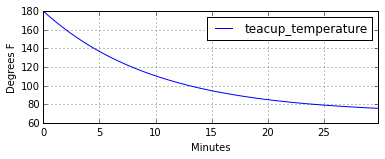
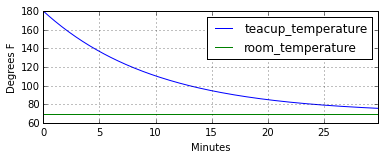
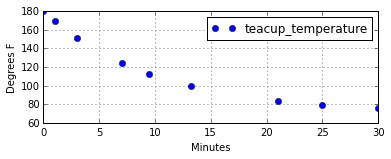
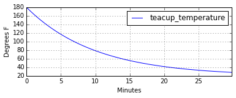
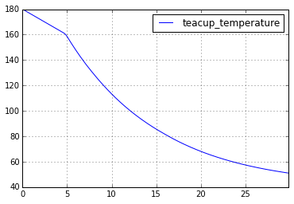

Hello World: The Teacup Model
-----------------------------

This notebook demonstrates the basic capability of PySD using a model of
a cup of tea cooling to room temperature.

Our model simulates `Newton's Law of
Cooling <http://www.ugrad.math.ubc.ca/coursedoc/math100/notes/diffeqs/cool.html>`__,
which follows the functional form:

.. math:: \frac{dT}{dt} = k(T - T_{ambient})

This model has all of the canonical components of a system dynamics
model: a stock, a flow, a feedback loop, a control parameter, and
exhibits dynamic behavior. The model equations are:

::

    Characteristic Time=
            10
    Units: Minutes

    Heat Loss to Room=
        (Teacup Temperature - Room Temperature) / Characteristic Time
    Units: Degrees/Minute
    This is the rate at which heat flows from the cup into the room. 

    Room Temperature=
        70
    Units: Degrees

    Teacup Temperature= INTEG (
        -Heat Loss to Room,
            180)
    Units: Degrees

Load the model
~~~~~~~~~~~~~~

We begin by importing the PySD module using the python standard import
commands. We then use PySD's Vensim model translator to import the model
from the Vensim model file and create a model object. We see that PySD
translates the vensim component names into acceptable python
identifiers.

.. code:: python

    %pylab inline
    import pysd
    model = pysd.read_vensim('Teacup.mdl')
    print model.components.doc()

.. parsed-literal::

    Populating the interactive namespace from numpy and matplotlib
    Import of Teacup.mdl
    
    characteristic_time = 10 
    Type: Flow or Auxiliary 
    Units: Minutes 
    
    final_time = 30 
    Type: Flow or Auxiliary 
    Units: Minute 
    The final time for the simulation.
    
    heat_loss_to_room = (self.teacup_temperature()- self.room_temperature()) / self.characteristic_time() 
    Type: Flow or Auxiliary 
    Units: Degrees/Minute 
    This is the rate at which heat flows from the cup into the room. We can \
                    ignore it at this point.
    
    initial_time = 0 
    Type: Flow or Auxiliary 
    Units: Minute 
    The initial time for the simulation.
    
    room_temperature = 70 
    Type: Flow or Auxiliary 
    Units:  
    
    teacup_temperature = -self.heat_loss_to_room() 
    Initial Value: 180 
    Type: Stock 
    Do not overwrite this functionUnits: Degrees 
    
    time_step = 0.125 
    Type: Flow or Auxiliary 
    Units: Minute [0,?] 
    The time step for the simulation.
    
    

Run with default parameters
~~~~~~~~~~~~~~~~~~~~~~~~~~~

To understand the general behavior of the model, we can run a simulation
using the default parameters specified by the Vensim model file. The
default behavior of the run function is to return the value of the
stocks as a `pandas <http://pandas.pydata.org/>`__ dataframe:

.. code:: python

    stocks = model.run()
    stocks.head(5)

.. raw:: html

    

    <table border="1" class="dataframe">
      <thead>
        <tr style="text-align: right;">
          <th></th>
          <th>teacup_temperature</th>
        </tr>
      </thead>
      <tbody>
        <tr>
          <th>0.000</th>
          <td>180.000000</td>
        </tr>
        <tr>
          <th>0.125</th>
          <td>178.633556</td>
        </tr>
        <tr>
          <th>0.250</th>
          <td>177.284091</td>
        </tr>
        <tr>
          <th>0.375</th>
          <td>175.951387</td>
        </tr>
        <tr>
          <th>0.500</th>
          <td>174.635237</td>
        </tr>
      </tbody>
    </table>
    

Pandas has some simple plotting utility built in which allows us to
easily visualize the results.

.. code:: python

    plt.figure(figsize(6,2))
    stocks.plot()
    plt.ylabel('Degrees F')
    plt.xlabel('Minutes');

.. parsed-literal::

    <matplotlib.figure.Figure at 0x11596e790>

Return additional model components
~~~~~~~~~~~~~~~~~~~~~~~~~~~~~~~~~~

If we wish to see the values of model components other than the stocks,
we can pass a list of component names with the keyword argument
``return_columns``. This will change the columns of the returned
dataframe such that they contain samples of the requested model
components:

.. code:: python

    values = model.run(return_columns=['teacup_temperature', 'room_temperature'])
    values.plot()
    plt.ylabel('Degrees F')
    plt.xlabel('Minutes')
    values.head()

.. raw:: html

    

    <table border="1" class="dataframe">
      <thead>
        <tr style="text-align: right;">
          <th></th>
          <th>teacup_temperature</th>
          <th>room_temperature</th>
        </tr>
      </thead>
      <tbody>
        <tr>
          <th>0.000</th>
          <td>180.000000</td>
          <td>70</td>
        </tr>
        <tr>
          <th>0.125</th>
          <td>178.633556</td>
          <td>70</td>
        </tr>
        <tr>
          <th>0.250</th>
          <td>177.284091</td>
          <td>70</td>
        </tr>
        <tr>
          <th>0.375</th>
          <td>175.951387</td>
          <td>70</td>
        </tr>
        <tr>
          <th>0.500</th>
          <td>174.635237</td>
          <td>70</td>
        </tr>
      </tbody>
    </table>
    

Return values at a specific time
~~~~~~~~~~~~~~~~~~~~~~~~~~~~~~~~

Sometimes we want to specify the timestamps that the run function should
return values. For instance, if we are comparing the result of our model
with data that arrives at irregular time intervals. We can do so using
the ``return_timestamps`` keyword argument. This argument expects a list
of timestamps, and will return values at those timestamps.

.. code:: python

    stocks = model.run(return_timestamps=[0,1,3,7,9.5, 13.178, 21, 25, 30])
    stocks.plot(linewidth=0, marker='o')
    plt.ylabel('Degrees F')
    plt.xlabel('Minutes')
    stocks.head()

.. raw:: html

    

    <table border="1" class="dataframe">
      <thead>
        <tr style="text-align: right;">
          <th></th>
          <th>teacup_temperature</th>
        </tr>
      </thead>
      <tbody>
        <tr>
          <th>0.0</th>
          <td>180.000000</td>
        </tr>
        <tr>
          <th>1.0</th>
          <td>169.532117</td>
        </tr>
        <tr>
          <th>3.0</th>
          <td>151.490005</td>
        </tr>
        <tr>
          <th>7.0</th>
          <td>124.624384</td>
        </tr>
        <tr>
          <th>9.5</th>
          <td>112.541513</td>
        </tr>
      </tbody>
    </table>
    

Modify parameter values
~~~~~~~~~~~~~~~~~~~~~~~

We can specify changes to the parameters of the model in the call to the
run function. Here we set the room temperature to the constant value of
20 degrees before running the simulation.

.. code:: python

    values = model.run(params={'room_temperature':20})
    values.plot()
    plt.ylabel('Degrees F')
    plt.xlabel('Minutes');

We can also specify that a parameter be set with a time-varying input.
In this case, we raise the room temperature from 20 to 80 degrees over
the course of the 30 minutes. We can see that once the room temperature
rises above that of the tea, the tea begins to warm up again.

.. code:: python

    import pandas as pd
    temp_timeseries = pd.Series(index=range(30), data=range(20,80,2))
    values = model.run(params={'room_temperature':temp_timeseries},return_columns=['teacup_temperature', 'room_temperature'])
    values.plot()
    plt.ylabel('Degrees F')
    plt.xlabel('Minutes');

.. image:: Teacup_Regression_Example_files/Teacup_Regression_Example_13_0.png

Specifying model initial conditions
~~~~~~~~~~~~~~~~~~~~~~~~~~~~~~~~~~~

In addition to parameters, we can set the initial conditions for the
model, by passing a tuple to the argument ``initial_condition``. In this
case, the first element of the tuple is the time at which the model
should begin its execution, and the second element of the tuple is a
dictionary containing the values of the stocks at that particular time.

.. code:: python

    stocks = model.run(params={'room_temperature':75},
                       initial_condition=(0, {'teacup_temperature':33}))
    stocks.plot()
    plt.ylabel('Degrees F')
    plt.xlabel('Minutes');

.. image:: Teacup_Regression_Example_files/Teacup_Regression_Example_15_0.png

Once a model has been run, we can choose to run it forwards again from
its current state. To do this we specify a new set of timestamps over
which we would like the model to run, and pass the
``intitial_condition`` argument the string ``"current"``.

.. code:: python

    values = model.run(initial_condition='current', return_timestamps=range(31,45))
    values.plot()
    plt.ylabel('Degrees F')
    plt.xlabel('Minutes');

.. image:: Teacup_Regression_Example_files/Teacup_Regression_Example_17_0.png

.. code:: python

    #generate a dataset from the model to fit our regression to
    
    X_training = []
    Y_training = []
    for room_temp in np.random.uniform(60, 80, size=20):
        for tea_temp in np.random.uniform(60, 200, size=200):
            X_training.append([room_temp, tea_temp])
            model.set_components(params={'room_temperature':room_temp})
            model.components.state['teacup_temperature'] = tea_temp
            Y_training.append(model.components.heat_loss_to_room())

.. code:: python

    from sklearn.svm import SVR
    
    regression = SVR()
    regression.fit(X_training, Y_training)

.. parsed-literal::

    SVR(C=1.0, cache_size=200, coef0=0.0, degree=3, epsilon=0.1, gamma=0.0,
      kernel='rbf', max_iter=-1, probability=False, random_state=None,
      shrinking=True, tol=0.001, verbose=False)

.. code:: python

    
    plt.plot(range(40, 180), [regression.predict([66, teatemp]) for teatemp in range(40, 180)])

.. parsed-literal::

    [<matplotlib.lines.Line2D at 0x114522e50>]

.. image:: Teacup_Regression_Example_files/Teacup_Regression_Example_20_1.png

.. code:: python

    def new_heatflow_function():
        """ Replaces the original flowrate equation with a regression model"""
        tea_temp = model.components.teacup_temperature()
        room_temp = model.components.room_temperature()
        return regression.predict([room_temp, tea_temp])[0]
    
    model.components.heat_loss_to_room = new_heatflow_function

.. code:: python

    model.components.heat_loss_to_room()

.. parsed-literal::

    10.823590010163151

.. code:: python

    model.run().plot()

.. parsed-literal::

    <matplotlib.axes._subplots.AxesSubplot at 0x1144cf410>

.. code:: python

    model.components.teacup_temperature()

.. parsed-literal::

    180

