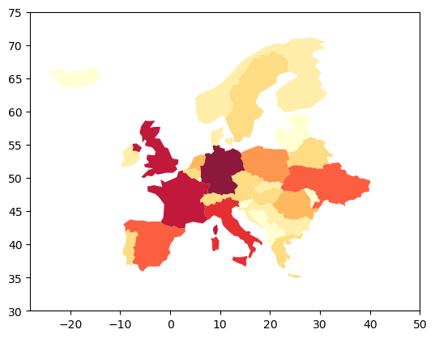

Installation
------------

conda install -c ioos geopandas=0.2.0.dev0
^^^^^^^^^^^^^^^^^^^^^^^^^^^^^^^^^^^^^^^^^^

Using SD to understand the SD Fever
-----------------------------------

A new emerging infectious disease in Europe, which does not spread to neighboring countries
~~~~~~~~~~~~~~~~~~~~~~~~~~~~~~~~~~~~~~~~~~~~~~~~~~~~~~~~~~~~~~~~~~~~~~~~~~~~~~~~~~~~~~~~~~~

In this script, we will use georeferenced data at a national level to
simulate a multiregional infectious disease model. We’ll then present
the advantages to project spatial data produced by our simulation back
on a map.

.. code:: ipython3

    %matplotlib inline
    import pandas as pd
    import pysd

A simple SIR model
~~~~~~~~~~~~~~~~~~

The model we’ll use to represent the dynamics of the disease is a simple
SIR model, with individuals aggregated into stocks by their health
condition S-Susceptible, I-Infectious, R-Recovered. We assume that the
complete population is susceptible, therefore the initial value of
susceptible stock is equal to the total population. In addition, we
built on the hypothesis that from now all infected person are reported.

.. code:: ipython3

    from IPython.display import Image
    Image(filename='../../models/SD_Fever/SIR_model.png')

.. image:: Doing_more_with_spatialdata_multi_regional_SIR_Model_files/Doing_more_with_spatialdata_multi_regional_SIR_Model_4_0.png

In Vensim our model was parameterized with 1000 suceptible, 5 infectious
and 0 recovered individuals, a recovery period of 5 days and a contact
infectivity of 70%.

When we do not specificy anything else, the parameters and setting
(e.g. timestep, simulation time) from the Vensim model are used.

.. code:: ipython3

    model = pysd.read_vensim('../../models/SD_Fever/SIR_Simple.mdl')
    result = model.run(return_columns=[
                           'cumulative cases', 'report case', 'infect', 
                           'contact infectivity', 'recovery period', 'infectious', 
                           'recovered', 'recover', 'susceptible', 'total population'
                       ])
    result.plot();

.. image:: Doing_more_with_spatialdata_multi_regional_SIR_Model_files/Doing_more_with_spatialdata_multi_regional_SIR_Model_6_0.png

Recap
=====

Modify parameter values
-----------------------

As we have seen before, we can specify changes to the parameters of the
model in the call to the run function. Here we set the contact
infectivity to 30% before running the simulation again. If you like, try
what happens when you change some of the other parameters.

.. code:: ipython3

    result = model.run(params={ 'total_population':1000,
                                'contact_infectivity':.3, 
                                'recovery_period': 5
                              },
                       return_columns=[
                           'cumulative cases', 'report case', 'infect', 
                           'contact infectivity', 'recovery period', 'infectious', 
                           'recovered', 'recover', 'susceptible', 'total population']
                     )
    result.plot();

.. image:: Doing_more_with_spatialdata_multi_regional_SIR_Model_files/Doing_more_with_spatialdata_multi_regional_SIR_Model_9_0.png

Change Model settings
---------------------

We can also change in a very simpe manner the simulation time and
timestep of the model. An easy way to do it is to use numpy linspace
which returns evenly spaced numbers over a specified interval.

np.linspace(Start, Stop, Number of timestamps)

.. code:: ipython3

    import numpy as np
    sim_time = 10
    np.linspace(0, sim_time, num=sim_time*4+1)

.. parsed-literal::

    array([ 0.  ,  0.25,  0.5 ,  0.75,  1.  ,  1.25,  1.5 ,  1.75,  2.  ,
            2.25,  2.5 ,  2.75,  3.  ,  3.25,  3.5 ,  3.75,  4.  ,  4.25,
            4.5 ,  4.75,  5.  ,  5.25,  5.5 ,  5.75,  6.  ,  6.25,  6.5 ,
            6.75,  7.  ,  7.25,  7.5 ,  7.75,  8.  ,  8.25,  8.5 ,  8.75,
            9.  ,  9.25,  9.5 ,  9.75, 10.  ])

We can use the return_timestamps keyword argument in PySD. This argument
expects a list of timestamps, and will return simulation results at
those timestamps.

.. code:: ipython3

    model.run(return_timestamps=np.linspace(0, sim_time, num=sim_time*2+1))

.. raw:: html

    

    
    <table border="1" class="dataframe">
      <thead>
        <tr style="text-align: right;">
          <th></th>
          <th>FINAL TIME</th>
          <th>INITIAL TIME</th>
          <th>SAVEPER</th>
          <th>TIME STEP</th>
          <th>cumulative cases</th>
          <th>report case</th>
          <th>infect</th>
          <th>contact infectivity</th>
          <th>recovery period</th>
          <th>infectious</th>
          <th>recovered</th>
          <th>recover</th>
          <th>susceptible</th>
          <th>total population</th>
        </tr>
      </thead>
      <tbody>
        <tr>
          <th>0.0</th>
          <td>10.0</td>
          <td>0</td>
          <td>0.5</td>
          <td>0.5</td>
          <td>0.000000</td>
          <td>1.500000</td>
          <td>1.500000</td>
          <td>0.3</td>
          <td>5</td>
          <td>5.000000</td>
          <td>0.000000</td>
          <td>1.000000</td>
          <td>1000.000000</td>
          <td>1000</td>
        </tr>
        <tr>
          <th>0.5</th>
          <td>10.0</td>
          <td>0</td>
          <td>0.5</td>
          <td>0.5</td>
          <td>0.750000</td>
          <td>1.573819</td>
          <td>1.573819</td>
          <td>0.3</td>
          <td>5</td>
          <td>5.250000</td>
          <td>0.500000</td>
          <td>1.050000</td>
          <td>999.250000</td>
          <td>1000</td>
        </tr>
        <tr>
          <th>1.0</th>
          <td>10.0</td>
          <td>0</td>
          <td>0.5</td>
          <td>0.5</td>
          <td>1.536909</td>
          <td>1.651031</td>
          <td>1.651031</td>
          <td>0.3</td>
          <td>5</td>
          <td>5.511909</td>
          <td>1.025000</td>
          <td>1.102382</td>
          <td>998.463091</td>
          <td>1000</td>
        </tr>
        <tr>
          <th>1.5</th>
          <td>10.0</td>
          <td>0</td>
          <td>0.5</td>
          <td>0.5</td>
          <td>2.362425</td>
          <td>1.731769</td>
          <td>1.731769</td>
          <td>0.3</td>
          <td>5</td>
          <td>5.786234</td>
          <td>1.576191</td>
          <td>1.157247</td>
          <td>997.637575</td>
          <td>1000</td>
        </tr>
        <tr>
          <th>2.0</th>
          <td>10.0</td>
          <td>0</td>
          <td>0.5</td>
          <td>0.5</td>
          <td>3.228310</td>
          <td>1.816166</td>
          <td>1.816166</td>
          <td>0.3</td>
          <td>5</td>
          <td>6.073495</td>
          <td>2.154814</td>
          <td>1.214699</td>
          <td>996.771690</td>
          <td>1000</td>
        </tr>
        <tr>
          <th>2.5</th>
          <td>10.0</td>
          <td>0</td>
          <td>0.5</td>
          <td>0.5</td>
          <td>4.136393</td>
          <td>1.904359</td>
          <td>1.904359</td>
          <td>0.3</td>
          <td>5</td>
          <td>6.374229</td>
          <td>2.762164</td>
          <td>1.274846</td>
          <td>995.863607</td>
          <td>1000</td>
        </tr>
        <tr>
          <th>3.0</th>
          <td>10.0</td>
          <td>0</td>
          <td>0.5</td>
          <td>0.5</td>
          <td>5.088572</td>
          <td>1.996484</td>
          <td>1.996484</td>
          <td>0.3</td>
          <td>5</td>
          <td>6.688986</td>
          <td>3.399587</td>
          <td>1.337797</td>
          <td>994.911428</td>
          <td>1000</td>
        </tr>
        <tr>
          <th>3.5</th>
          <td>10.0</td>
          <td>0</td>
          <td>0.5</td>
          <td>0.5</td>
          <td>6.086815</td>
          <td>2.092683</td>
          <td>2.092683</td>
          <td>0.3</td>
          <td>5</td>
          <td>7.018329</td>
          <td>4.068485</td>
          <td>1.403666</td>
          <td>993.913185</td>
          <td>1000</td>
        </tr>
        <tr>
          <th>4.0</th>
          <td>10.0</td>
          <td>0</td>
          <td>0.5</td>
          <td>0.5</td>
          <td>7.133156</td>
          <td>2.193095</td>
          <td>2.193095</td>
          <td>0.3</td>
          <td>5</td>
          <td>7.362838</td>
          <td>4.770318</td>
          <td>1.472568</td>
          <td>992.866844</td>
          <td>1000</td>
        </tr>
        <tr>
          <th>4.5</th>
          <td>10.0</td>
          <td>0</td>
          <td>0.5</td>
          <td>0.5</td>
          <td>8.229704</td>
          <td>2.297863</td>
          <td>2.297863</td>
          <td>0.3</td>
          <td>5</td>
          <td>7.723102</td>
          <td>5.506602</td>
          <td>1.544620</td>
          <td>991.770296</td>
          <td>1000</td>
        </tr>
        <tr>
          <th>5.0</th>
          <td>10.0</td>
          <td>0</td>
          <td>0.5</td>
          <td>0.5</td>
          <td>9.378635</td>
          <td>2.407128</td>
          <td>2.407128</td>
          <td>0.3</td>
          <td>5</td>
          <td>8.099723</td>
          <td>6.278912</td>
          <td>1.619945</td>
          <td>990.621365</td>
          <td>1000</td>
        </tr>
        <tr>
          <th>5.5</th>
          <td>10.0</td>
          <td>0</td>
          <td>0.5</td>
          <td>0.5</td>
          <td>10.582199</td>
          <td>2.521031</td>
          <td>2.521031</td>
          <td>0.3</td>
          <td>5</td>
          <td>8.493314</td>
          <td>7.088885</td>
          <td>1.698663</td>
          <td>989.417801</td>
          <td>1000</td>
        </tr>
        <tr>
          <th>6.0</th>
          <td>10.0</td>
          <td>0</td>
          <td>0.5</td>
          <td>0.5</td>
          <td>11.842715</td>
          <td>2.639714</td>
          <td>2.639714</td>
          <td>0.3</td>
          <td>5</td>
          <td>8.904499</td>
          <td>7.938216</td>
          <td>1.780900</td>
          <td>988.157285</td>
          <td>1000</td>
        </tr>
        <tr>
          <th>6.5</th>
          <td>10.0</td>
          <td>0</td>
          <td>0.5</td>
          <td>0.5</td>
          <td>13.162571</td>
          <td>2.763314</td>
          <td>2.763314</td>
          <td>0.3</td>
          <td>5</td>
          <td>9.333905</td>
          <td>8.828666</td>
          <td>1.866781</td>
          <td>986.837429</td>
          <td>1000</td>
        </tr>
        <tr>
          <th>7.0</th>
          <td>10.0</td>
          <td>0</td>
          <td>0.5</td>
          <td>0.5</td>
          <td>14.544228</td>
          <td>2.891969</td>
          <td>2.891969</td>
          <td>0.3</td>
          <td>5</td>
          <td>9.782172</td>
          <td>9.762056</td>
          <td>1.956434</td>
          <td>985.455772</td>
          <td>1000</td>
        </tr>
        <tr>
          <th>7.5</th>
          <td>10.0</td>
          <td>0</td>
          <td>0.5</td>
          <td>0.5</td>
          <td>15.990213</td>
          <td>3.025812</td>
          <td>3.025812</td>
          <td>0.3</td>
          <td>5</td>
          <td>10.249939</td>
          <td>10.740274</td>
          <td>2.049988</td>
          <td>984.009787</td>
          <td>1000</td>
        </tr>
        <tr>
          <th>8.0</th>
          <td>10.0</td>
          <td>0</td>
          <td>0.5</td>
          <td>0.5</td>
          <td>17.503119</td>
          <td>3.164972</td>
          <td>3.164972</td>
          <td>0.3</td>
          <td>5</td>
          <td>10.737852</td>
          <td>11.765268</td>
          <td>2.147570</td>
          <td>982.496881</td>
          <td>1000</td>
        </tr>
        <tr>
          <th>8.5</th>
          <td>10.0</td>
          <td>0</td>
          <td>0.5</td>
          <td>0.5</td>
          <td>19.085605</td>
          <td>3.309572</td>
          <td>3.309572</td>
          <td>0.3</td>
          <td>5</td>
          <td>11.246552</td>
          <td>12.839053</td>
          <td>2.249310</td>
          <td>980.914395</td>
          <td>1000</td>
        </tr>
        <tr>
          <th>9.0</th>
          <td>10.0</td>
          <td>0</td>
          <td>0.5</td>
          <td>0.5</td>
          <td>20.740391</td>
          <td>3.459729</td>
          <td>3.459729</td>
          <td>0.3</td>
          <td>5</td>
          <td>11.776683</td>
          <td>13.963708</td>
          <td>2.355337</td>
          <td>979.259609</td>
          <td>1000</td>
        </tr>
        <tr>
          <th>9.5</th>
          <td>10.0</td>
          <td>0</td>
          <td>0.5</td>
          <td>0.5</td>
          <td>22.470255</td>
          <td>3.615554</td>
          <td>3.615554</td>
          <td>0.3</td>
          <td>5</td>
          <td>12.328879</td>
          <td>15.141376</td>
          <td>2.465776</td>
          <td>977.529745</td>
          <td>1000</td>
        </tr>
        <tr>
          <th>10.0</th>
          <td>10.0</td>
          <td>0</td>
          <td>0.5</td>
          <td>0.5</td>
          <td>24.278032</td>
          <td>3.777147</td>
          <td>3.777147</td>
          <td>0.3</td>
          <td>5</td>
          <td>12.903768</td>
          <td>16.374264</td>
          <td>2.580754</td>
          <td>975.721968</td>
          <td>1000</td>
        </tr>
      </tbody>
    </table>
    

Multi-regional SIR Model
========================

Geographical Information
------------------------

Geospatial information as area on a map linked to several properties are
typically stored into shapefiles.

For this script, we will use geopandas library to manage the shapefiles,
and utilize its inherent plotting functionality.

.. code:: ipython3

    import geopandas as gp
    
    shapefile = '../../data/SD_Fever/Shapefile/geo_df_EU.shp'
    geo_data = gp.GeoDataFrame.from_file(shapefile)
    geo_data.head(5)

.. raw:: html

    

    
    <table border="1" class="dataframe">
      <thead>
        <tr style="text-align: right;">
          <th></th>
          <th>population</th>
          <th>country</th>
          <th>inf_rate</th>
          <th>geometry</th>
        </tr>
      </thead>
      <tbody>
        <tr>
          <th>0</th>
          <td>5347896.0</td>
          <td>Norway</td>
          <td>0.012681</td>
          <td>MULTIPOLYGON (((15.14282 79.67431, 15.52255 80...</td>
        </tr>
        <tr>
          <th>1</th>
          <td>67059887.0</td>
          <td>France</td>
          <td>0.276615</td>
          <td>MULTIPOLYGON (((-51.65780 4.15623, -52.24934 3...</td>
        </tr>
        <tr>
          <th>2</th>
          <td>10285453.0</td>
          <td>Sweden</td>
          <td>0.034167</td>
          <td>POLYGON ((11.02737 58.85615, 11.46827 59.43239...</td>
        </tr>
        <tr>
          <th>3</th>
          <td>9466856.0</td>
          <td>Belarus</td>
          <td>0.096774</td>
          <td>POLYGON ((28.17671 56.16913, 29.22951 55.91834...</td>
        </tr>
        <tr>
          <th>4</th>
          <td>44385155.0</td>
          <td>Ukraine</td>
          <td>0.186621</td>
          <td>POLYGON ((31.78599 52.10168, 32.15944 52.06125...</td>
        </tr>
      </tbody>
    </table>
    

Then we can project the geographic shape of the elements on a map.

.. code:: ipython3

    import matplotlib.pyplot as plt
    
    geo_data.plot()
    plt.xlim([-28, 50])
    plt.ylim([30, 75])
    plt.show()

.. image:: Doing_more_with_spatialdata_multi_regional_SIR_Model_files/Doing_more_with_spatialdata_multi_regional_SIR_Model_17_0.png

And plot on of the georeferenced property (e.g. population)

.. code:: ipython3

    geo_data.plot(column='population', scheme='fisher_jenks', alpha=0.9, k=9, linewidth=0.1,
                 cmap=plt.cm.YlOrRd, legend=False)
    plt.xlim([-28, 50])
    plt.ylim([30, 75])
    plt.show()

Run the model for each country
------------------------------

We want to run the core SD model for each country, with country specific
paramterization.

Thus, we formulate a function that based on each row parameterizes the
model with the value from geodata, performs the simulation and finally
returns the number of infectious individuals over time.

.. code:: ipython3

    def runner(row):
        sim_time = 200
        params= {'total_population': row['population'],
                 'contact_infectivity' : row['inf_rate']}
        res = model.run(params=params,
                        return_timestamps=np.linspace(0, sim_time, num=sim_time*2+1))
        return res['infectious']

Apply function along rows of the Dataframe.
^^^^^^^^^^^^^^^^^^^^^^^^^^^^^^^^^^^^^^^^^^^

We want to apply the function row-wise (by country) therefore we set
axis to 1 (row) instead of default 0 (column). The result is a new
dataframe with the produced simulation for each country.

.. code:: ipython3

    res = geo_data.apply(runner, axis=1)
    res.head()

.. raw:: html

    

    
    <table border="1" class="dataframe">
      <thead>
        <tr style="text-align: right;">
          <th></th>
          <th>0.0</th>
          <th>0.5</th>
          <th>1.0</th>
          <th>1.5</th>
          <th>2.0</th>
          <th>2.5</th>
          <th>3.0</th>
          <th>3.5</th>
          <th>4.0</th>
          <th>4.5</th>
          <th>...</th>
          <th>195.5</th>
          <th>196.0</th>
          <th>196.5</th>
          <th>197.0</th>
          <th>197.5</th>
          <th>198.0</th>
          <th>198.5</th>
          <th>199.0</th>
          <th>199.5</th>
          <th>200.0</th>
        </tr>
      </thead>
      <tbody>
        <tr>
          <th>0</th>
          <td>5.0</td>
          <td>4.531702</td>
          <td>4.107264</td>
          <td>3.722579</td>
          <td>3.373923</td>
          <td>3.057923</td>
          <td>2.771519</td>
          <td>2.511939</td>
          <td>2.276672</td>
          <td>2.063439</td>
          <td>...</td>
          <td>9.996953e-17</td>
          <td>9.060642e-17</td>
          <td>8.212025e-17</td>
          <td>7.442889e-17</td>
          <td>6.745791e-17</td>
          <td>6.113982e-17</td>
          <td>5.541348e-17</td>
          <td>5.022347e-17</td>
          <td>4.551956e-17</td>
          <td>4.125621e-17</td>
        </tr>
        <tr>
          <th>1</th>
          <td>5.0</td>
          <td>5.191538</td>
          <td>5.390414</td>
          <td>5.596907</td>
          <td>5.811312</td>
          <td>6.033929</td>
          <td>6.265074</td>
          <td>6.505074</td>
          <td>6.754268</td>
          <td>7.013008</td>
          <td>...</td>
          <td>2.877902e+06</td>
          <td>2.880190e+06</td>
          <td>2.880756e+06</td>
          <td>2.879608e+06</td>
          <td>2.876757e+06</td>
          <td>2.872216e+06</td>
          <td>2.866006e+06</td>
          <td>2.858148e+06</td>
          <td>2.848668e+06</td>
          <td>2.837596e+06</td>
        </tr>
        <tr>
          <th>2</th>
          <td>5.0</td>
          <td>4.585418</td>
          <td>4.205211</td>
          <td>3.856530</td>
          <td>3.536761</td>
          <td>3.243505</td>
          <td>2.974565</td>
          <td>2.727925</td>
          <td>2.501735</td>
          <td>2.294300</td>
          <td>...</td>
          <td>1.001973e-14</td>
          <td>9.188925e-15</td>
          <td>8.427012e-15</td>
          <td>7.728275e-15</td>
          <td>7.087474e-15</td>
          <td>6.499806e-15</td>
          <td>5.960865e-15</td>
          <td>5.466611e-15</td>
          <td>5.013340e-15</td>
          <td>4.597651e-15</td>
        </tr>
        <tr>
          <th>3</th>
          <td>5.0</td>
          <td>4.741935</td>
          <td>4.497189</td>
          <td>4.265076</td>
          <td>4.044943</td>
          <td>3.836171</td>
          <td>3.638175</td>
          <td>3.450397</td>
          <td>3.272312</td>
          <td>3.103418</td>
          <td>...</td>
          <td>5.015702e-09</td>
          <td>4.756826e-09</td>
          <td>4.511312e-09</td>
          <td>4.278469e-09</td>
          <td>4.057645e-09</td>
          <td>3.848217e-09</td>
          <td>3.649599e-09</td>
          <td>3.461232e-09</td>
          <td>3.282588e-09</td>
          <td>3.113163e-09</td>
        </tr>
        <tr>
          <th>4</th>
          <td>5.0</td>
          <td>4.966553</td>
          <td>4.933330</td>
          <td>4.900329</td>
          <td>4.867548</td>
          <td>4.834987</td>
          <td>4.802644</td>
          <td>4.770517</td>
          <td>4.738605</td>
          <td>4.706907</td>
          <td>...</td>
          <td>3.624228e-01</td>
          <td>3.599984e-01</td>
          <td>3.575902e-01</td>
          <td>3.551980e-01</td>
          <td>3.528219e-01</td>
          <td>3.504617e-01</td>
          <td>3.481173e-01</td>
          <td>3.457885e-01</td>
          <td>3.434754e-01</td>
          <td>3.411777e-01</td>
        </tr>
      </tbody>
    </table>
    
5 rows × 401 columns

    

Transpose simulation results for plotting
-----------------------------------------

The pandas line plot assumes that rows represent the timeseries and
columns the different objects. Since our data is not yet in this form,
we have to transpose the data. In pandas all we have to do is add an .T
at the end.

.. code:: ipython3

    import pandas as pd
    df = pd.DataFrame(res).T

.. code:: ipython3

    df.head(2)

.. raw:: html

    

    
    <table border="1" class="dataframe">
      <thead>
        <tr style="text-align: right;">
          <th></th>
          <th>0</th>
          <th>1</th>
          <th>2</th>
          <th>3</th>
          <th>4</th>
          <th>5</th>
          <th>6</th>
          <th>7</th>
          <th>8</th>
          <th>9</th>
          <th>...</th>
          <th>28</th>
          <th>29</th>
          <th>30</th>
          <th>31</th>
          <th>32</th>
          <th>33</th>
          <th>34</th>
          <th>35</th>
          <th>36</th>
          <th>37</th>
        </tr>
      </thead>
      <tbody>
        <tr>
          <th>0.0</th>
          <td>5.000000</td>
          <td>5.000000</td>
          <td>5.000000</td>
          <td>5.000000</td>
          <td>5.000000</td>
          <td>5.00000</td>
          <td>5.000000</td>
          <td>5.000000</td>
          <td>5.000000</td>
          <td>5.000000</td>
          <td>...</td>
          <td>5.0</td>
          <td>5.000000</td>
          <td>5.000000</td>
          <td>5.000000</td>
          <td>5.000000</td>
          <td>5.000000</td>
          <td>5.000000</td>
          <td>5.000000</td>
          <td>5.000000</td>
          <td>5.000000</td>
        </tr>
        <tr>
          <th>0.5</th>
          <td>4.531702</td>
          <td>5.191538</td>
          <td>4.585418</td>
          <td>4.741935</td>
          <td>4.966553</td>
          <td>5.19772</td>
          <td>5.152267</td>
          <td>5.165813</td>
          <td>5.015223</td>
          <td>5.021537</td>
          <td>...</td>
          <td>4.5</td>
          <td>5.202822</td>
          <td>4.552659</td>
          <td>5.210224</td>
          <td>5.290059</td>
          <td>4.928924</td>
          <td>5.074109</td>
          <td>5.102701</td>
          <td>4.807623</td>
          <td>5.598635</td>
        </tr>
      </tbody>
    </table>
    
2 rows × 38 columns

    

.. code:: ipython3

    df.plot(legend=False);

.. image:: Doing_more_with_spatialdata_multi_regional_SIR_Model_files/Doing_more_with_spatialdata_multi_regional_SIR_Model_27_0.png

Comparative Analysis
--------------------

Next lets try to compare how severe a country is hit by the SD fever.

Rather than looking at the number of infectious persons over time, a
better indicator for comparative analysis are the cumulative cases as
percentage of population in each country.

We can reuse our code from before but instead of returning the number of
infecious we return the cumulative cases.

.. code:: ipython3

    def runner(row):
        sim_time = 200
        params= {'total_population':row['population'],
                 'contact_infectivity' : row['inf_rate']}
        res = model.run(params=params,
                        return_timestamps=range(0,sim_time))
        return res['cumulative cases']
    
    #TIP: Ensure you are using lower case letters and the character _  not space

.. code:: ipython3

    res = geo_data.apply(runner, axis=1)
    
    res.head()

.. raw:: html

    

    
    <table border="1" class="dataframe">
      <thead>
        <tr style="text-align: right;">
          <th></th>
          <th>0</th>
          <th>1</th>
          <th>2</th>
          <th>3</th>
          <th>4</th>
          <th>5</th>
          <th>6</th>
          <th>7</th>
          <th>8</th>
          <th>9</th>
          <th>...</th>
          <th>190</th>
          <th>191</th>
          <th>192</th>
          <th>193</th>
          <th>194</th>
          <th>195</th>
          <th>196</th>
          <th>197</th>
          <th>198</th>
          <th>199</th>
        </tr>
      </thead>
      <tbody>
        <tr>
          <th>0</th>
          <td>0.0</td>
          <td>0.060434</td>
          <td>0.110078</td>
          <td>0.150858</td>
          <td>0.184356</td>
          <td>0.211874</td>
          <td>0.234479</td>
          <td>0.253047</td>
          <td>0.268300</td>
          <td>0.280830</td>
          <td>...</td>
          <td>3.384762e-01</td>
          <td>3.384762e-01</td>
          <td>3.384762e-01</td>
          <td>3.384762e-01</td>
          <td>3.384762e-01</td>
          <td>3.384762e-01</td>
          <td>3.384762e-01</td>
          <td>3.384762e-01</td>
          <td>3.384762e-01</td>
          <td>3.384762e-01</td>
        </tr>
        <tr>
          <th>1</th>
          <td>0.0</td>
          <td>1.409567</td>
          <td>2.929197</td>
          <td>4.567484</td>
          <td>6.333693</td>
          <td>8.237812</td>
          <td>10.290610</td>
          <td>12.503695</td>
          <td>14.889584</td>
          <td>17.461770</td>
          <td>...</td>
          <td>1.494990e+07</td>
          <td>1.553967e+07</td>
          <td>1.613077e+07</td>
          <td>1.672170e+07</td>
          <td>1.731093e+07</td>
          <td>1.789700e+07</td>
          <td>1.847848e+07</td>
          <td>1.905399e+07</td>
          <td>1.962224e+07</td>
          <td>2.018199e+07</td>
        </tr>
        <tr>
          <th>2</th>
          <td>0.0</td>
          <td>0.163753</td>
          <td>0.301477</td>
          <td>0.417308</td>
          <td>0.514727</td>
          <td>0.596660</td>
          <td>0.665570</td>
          <td>0.723525</td>
          <td>0.772269</td>
          <td>0.813264</td>
          <td>...</td>
          <td>1.030168e+00</td>
          <td>1.030168e+00</td>
          <td>1.030168e+00</td>
          <td>1.030168e+00</td>
          <td>1.030168e+00</td>
          <td>1.030168e+00</td>
          <td>1.030168e+00</td>
          <td>1.030168e+00</td>
          <td>1.030168e+00</td>
          <td>1.030168e+00</td>
        </tr>
        <tr>
          <th>3</th>
          <td>0.0</td>
          <td>0.471383</td>
          <td>0.895363</td>
          <td>1.276706</td>
          <td>1.619701</td>
          <td>1.928203</td>
          <td>2.205682</td>
          <td>2.455257</td>
          <td>2.679734</td>
          <td>2.881637</td>
          <td>...</td>
          <td>4.687479e+00</td>
          <td>4.687479e+00</td>
          <td>4.687479e+00</td>
          <td>4.687479e+00</td>
          <td>4.687479e+00</td>
          <td>4.687479e+00</td>
          <td>4.687479e+00</td>
          <td>4.687479e+00</td>
          <td>4.687479e+00</td>
          <td>4.687479e+00</td>
        </tr>
        <tr>
          <th>4</th>
          <td>0.0</td>
          <td>0.929985</td>
          <td>1.847569</td>
          <td>2.752919</td>
          <td>3.646196</td>
          <td>4.527562</td>
          <td>5.397177</td>
          <td>6.255195</td>
          <td>7.101773</td>
          <td>7.937062</td>
          <td>...</td>
          <td>6.430156e+01</td>
          <td>6.437414e+01</td>
          <td>6.444574e+01</td>
          <td>6.451640e+01</td>
          <td>6.458611e+01</td>
          <td>6.465489e+01</td>
          <td>6.472275e+01</td>
          <td>6.478971e+01</td>
          <td>6.485577e+01</td>
          <td>6.492096e+01</td>
        </tr>
      </tbody>
    </table>
    
5 rows × 200 columns

    

Now, how do we get from the cumulative cases to the cumulative cases as % of the population?
~~~~~~~~~~~~~~~~~~~~~~~~~~~~~~~~~~~~~~~~~~~~~~~~~~~~~~~~~~~~~~~~~~~~~~~~~~~~~~~~~~~~~~~~~~~~

The answer is a simple matrix operation: divide row-wise the elements of
our computed values by the column of the original geo data set where we
had the population in each country.

Let’s try to perform this type of operation on a minimal example.

.. code:: ipython3

    # Create arbitrary column
    column = pd.Series([10, 2])
    column

.. parsed-literal::

    0    10
    1     2
    dtype: int64

.. code:: ipython3

    # Create arbitrary pandas dataframe
    df = pd.DataFrame(np.random.randint(1,5,size=(2, 3)), columns=list('ABC'))
    df 

.. raw:: html

    

    
    <table border="1" class="dataframe">
      <thead>
        <tr style="text-align: right;">
          <th></th>
          <th>A</th>
          <th>B</th>
          <th>C</th>
        </tr>
      </thead>
      <tbody>
        <tr>
          <th>0</th>
          <td>1</td>
          <td>4</td>
          <td>4</td>
        </tr>
        <tr>
          <th>1</th>
          <td>3</td>
          <td>1</td>
          <td>4</td>
        </tr>
      </tbody>
    </table>
    

.. code:: ipython3

    column*df["A"]

.. parsed-literal::

    0    10
    1     6
    dtype: int64

Now we can translate this operation on our actual problem.

.. code:: ipython3

    res = pd.DataFrame(res.T/geo_data["population"])

.. code:: ipython3

    res.plot(legend=False);

.. image:: Doing_more_with_spatialdata_multi_regional_SIR_Model_files/Doing_more_with_spatialdata_multi_regional_SIR_Model_37_0.png

Analysis of results
-------------------

For example, we could study the impact of contact infectivity on the
cumulative cases at the end of the simulation

.. code:: ipython3

    geo_data['totalcases%pop'] = res.loc[199] # Slice the final value at the end of the simulation
    df_scatter = pd.DataFrame(geo_data) # Geopandas dataframe to pandas Dataframe (geopandas tries to perform spatial analysis)
    df_scatter.plot.scatter(x='inf_rate', y='totalcases%pop'); # Plot infectivity versus cumulative cases at the end of the simulation

.. image:: Doing_more_with_spatialdata_multi_regional_SIR_Model_files/Doing_more_with_spatialdata_multi_regional_SIR_Model_39_0.png

How Spatial Analysis Leads to Insight
-------------------------------------

Finally, we present slighltly advanced Python scripts to get our
simulation results projected on the map.

We merge the complete simulation results with our original georeferenced
information just as we did in the step before.

.. code:: ipython3

    geo_data.head(2)

.. raw:: html

    

    
    <table border="1" class="dataframe">
      <thead>
        <tr style="text-align: right;">
          <th></th>
          <th>population</th>
          <th>country</th>
          <th>inf_rate</th>
          <th>geometry</th>
          <th>totalcases%pop</th>
        </tr>
      </thead>
      <tbody>
        <tr>
          <th>0</th>
          <td>5347896.0</td>
          <td>Norway</td>
          <td>0.012681</td>
          <td>MULTIPOLYGON (((15.14282 79.67431, 15.52255 80...</td>
          <td>6.329147e-08</td>
        </tr>
        <tr>
          <th>1</th>
          <td>67059887.0</td>
          <td>France</td>
          <td>0.276615</td>
          <td>MULTIPOLYGON (((-51.65780 4.15623, -52.24934 3...</td>
          <td>3.009547e-01</td>
        </tr>
      </tbody>
    </table>
    

.. code:: ipython3

    res.head(2)

.. raw:: html

    

    
    <table border="1" class="dataframe">
      <thead>
        <tr style="text-align: right;">
          <th></th>
          <th>0</th>
          <th>1</th>
          <th>2</th>
          <th>3</th>
          <th>4</th>
          <th>5</th>
          <th>6</th>
          <th>7</th>
          <th>8</th>
          <th>9</th>
          <th>...</th>
          <th>28</th>
          <th>29</th>
          <th>30</th>
          <th>31</th>
          <th>32</th>
          <th>33</th>
          <th>34</th>
          <th>35</th>
          <th>36</th>
          <th>37</th>
        </tr>
      </thead>
      <tbody>
        <tr>
          <th>0</th>
          <td>0.000000e+00</td>
          <td>0.000000e+00</td>
          <td>0.000000e+00</td>
          <td>0.000000e+00</td>
          <td>0.000000e+00</td>
          <td>0.000000e+00</td>
          <td>0.000000e+00</td>
          <td>0.000000e+00</td>
          <td>0.000000e+00</td>
          <td>0.000000e+00</td>
          <td>...</td>
          <td>0.0</td>
          <td>0.000000e+00</td>
          <td>0.000000e+00</td>
          <td>0.000000e+00</td>
          <td>0.000000e+00</td>
          <td>0.000000e+00</td>
          <td>0.000000e+00</td>
          <td>0.000000e+00</td>
          <td>0.000000e+00</td>
          <td>0.000000</td>
        </tr>
        <tr>
          <th>1</th>
          <td>1.130052e-08</td>
          <td>2.101953e-08</td>
          <td>1.592086e-08</td>
          <td>4.979298e-08</td>
          <td>2.095261e-08</td>
          <td>3.747692e-08</td>
          <td>1.491931e-07</td>
          <td>1.385581e-07</td>
          <td>3.883204e-07</td>
          <td>5.400350e-08</td>
          <td>...</td>
          <td>0.0</td>
          <td>6.868723e-07</td>
          <td>1.822466e-08</td>
          <td>2.659132e-07</td>
          <td>1.523894e-07</td>
          <td>2.580278e-07</td>
          <td>5.551959e-07</td>
          <td>1.753471e-07</td>
          <td>9.698978e-07</td>
          <td>0.000001</td>
        </tr>
      </tbody>
    </table>
    
2 rows × 38 columns

    

.. code:: ipython3

    geo_data_merged = geo_data.merge(res.T, left_index=True, right_index=True)
    geo_data_merged.head()

.. raw:: html

    

    
    <table border="1" class="dataframe">
      <thead>
        <tr style="text-align: right;">
          <th></th>
          <th>population</th>
          <th>country</th>
          <th>inf_rate</th>
          <th>geometry</th>
          <th>totalcases%pop</th>
          <th>0</th>
          <th>1</th>
          <th>2</th>
          <th>3</th>
          <th>4</th>
          <th>...</th>
          <th>190</th>
          <th>191</th>
          <th>192</th>
          <th>193</th>
          <th>194</th>
          <th>195</th>
          <th>196</th>
          <th>197</th>
          <th>198</th>
          <th>199</th>
        </tr>
      </thead>
      <tbody>
        <tr>
          <th>0</th>
          <td>5347896.0</td>
          <td>Norway</td>
          <td>0.012681</td>
          <td>MULTIPOLYGON (((15.14282 79.67431, 15.52255 80...</td>
          <td>6.329147e-08</td>
          <td>0.0</td>
          <td>1.130052e-08</td>
          <td>2.058336e-08</td>
          <td>2.820878e-08</td>
          <td>3.447269e-08</td>
          <td>...</td>
          <td>6.329147e-08</td>
          <td>6.329147e-08</td>
          <td>6.329147e-08</td>
          <td>6.329147e-08</td>
          <td>6.329147e-08</td>
          <td>6.329147e-08</td>
          <td>6.329147e-08</td>
          <td>6.329147e-08</td>
          <td>6.329147e-08</td>
          <td>6.329147e-08</td>
        </tr>
        <tr>
          <th>1</th>
          <td>67059887.0</td>
          <td>France</td>
          <td>0.276615</td>
          <td>MULTIPOLYGON (((-51.65780 4.15623, -52.24934 3...</td>
          <td>3.009547e-01</td>
          <td>0.0</td>
          <td>2.101953e-08</td>
          <td>4.368032e-08</td>
          <td>6.811053e-08</td>
          <td>9.444831e-08</td>
          <td>...</td>
          <td>2.229336e-01</td>
          <td>2.317283e-01</td>
          <td>2.405428e-01</td>
          <td>2.493547e-01</td>
          <td>2.581413e-01</td>
          <td>2.668809e-01</td>
          <td>2.755519e-01</td>
          <td>2.841340e-01</td>
          <td>2.926077e-01</td>
          <td>3.009547e-01</td>
        </tr>
        <tr>
          <th>2</th>
          <td>10285453.0</td>
          <td>Sweden</td>
          <td>0.034167</td>
          <td>POLYGON ((11.02737 58.85615, 11.46827 59.43239...</td>
          <td>1.001578e-07</td>
          <td>0.0</td>
          <td>1.592086e-08</td>
          <td>2.931097e-08</td>
          <td>4.057262e-08</td>
          <td>5.004414e-08</td>
          <td>...</td>
          <td>1.001578e-07</td>
          <td>1.001578e-07</td>
          <td>1.001578e-07</td>
          <td>1.001578e-07</td>
          <td>1.001578e-07</td>
          <td>1.001578e-07</td>
          <td>1.001578e-07</td>
          <td>1.001578e-07</td>
          <td>1.001578e-07</td>
          <td>1.001578e-07</td>
        </tr>
        <tr>
          <th>3</th>
          <td>9466856.0</td>
          <td>Belarus</td>
          <td>0.096774</td>
          <td>POLYGON ((28.17671 56.16913, 29.22951 55.91834...</td>
          <td>4.951463e-07</td>
          <td>0.0</td>
          <td>4.979298e-08</td>
          <td>9.457867e-08</td>
          <td>1.348606e-07</td>
          <td>1.710917e-07</td>
          <td>...</td>
          <td>4.951463e-07</td>
          <td>4.951463e-07</td>
          <td>4.951463e-07</td>
          <td>4.951463e-07</td>
          <td>4.951463e-07</td>
          <td>4.951463e-07</td>
          <td>4.951463e-07</td>
          <td>4.951463e-07</td>
          <td>4.951463e-07</td>
          <td>4.951463e-07</td>
        </tr>
        <tr>
          <th>4</th>
          <td>44385155.0</td>
          <td>Ukraine</td>
          <td>0.186621</td>
          <td>POLYGON ((31.78599 52.10168, 32.15944 52.06125...</td>
          <td>1.462673e-06</td>
          <td>0.0</td>
          <td>2.095261e-08</td>
          <td>4.162584e-08</td>
          <td>6.202341e-08</td>
          <td>8.214900e-08</td>
          <td>...</td>
          <td>1.448718e-06</td>
          <td>1.450353e-06</td>
          <td>1.451966e-06</td>
          <td>1.453558e-06</td>
          <td>1.455129e-06</td>
          <td>1.456678e-06</td>
          <td>1.458207e-06</td>
          <td>1.459716e-06</td>
          <td>1.461204e-06</td>
          <td>1.462673e-06</td>
        </tr>
      </tbody>
    </table>
    
5 rows × 205 columns

    

Plotting simulation results on map with Ipywidgets
--------------------------------------------------

Ipywidgets are interactive HTML widgets for IPython notebooks. Users
gain control of their data and can visualize changes in the data.

.. code:: ipython3

    import matplotlib as mpl
    from ipywidgets import interact, FloatSlider, IntSlider,RadioButtons, Dropdown
    sim_time = 200
    slider_time = IntSlider(description = 'Time Select',
                            min=0, max=sim_time-1, value=1)

.. code:: ipython3

    @interact(time = slider_time) # Scenario = select_scenario,
    def update_map(time): # Scenario
        ax = geo_data_merged.plot(column=time, scheme='fisherjenks', alpha=0.9, k=9, linewidth=0.1,
                 cmap=plt.cm.Reds, legend=True,  figsize=(20, 30))
        plt.xlim(-28, 50)
        plt.ylim(30, 75)
        plt.xticks([])
        plt.yticks([])

.. parsed-literal::

    interactive(children=(IntSlider(value=1, description='Time Select', max=199), Output()), _dom_classes=('widget…

