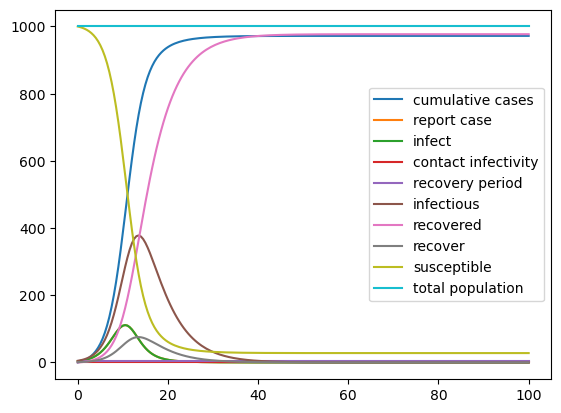
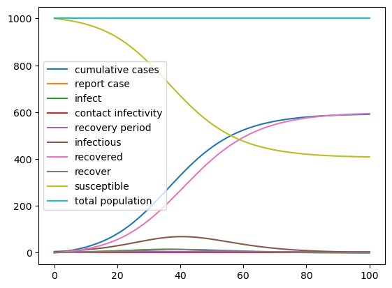
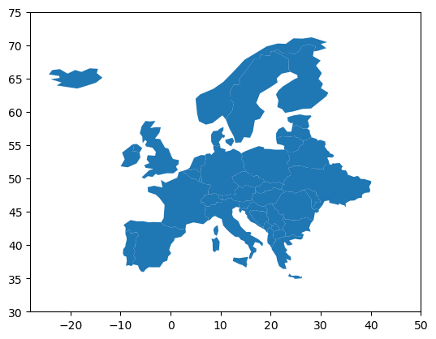
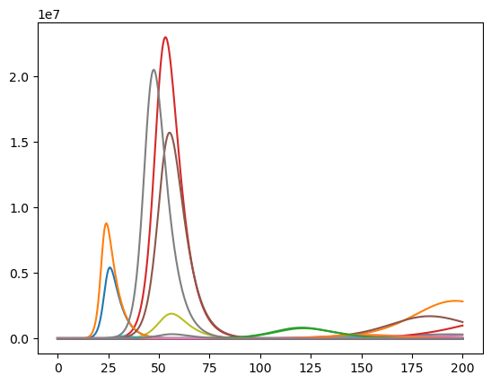
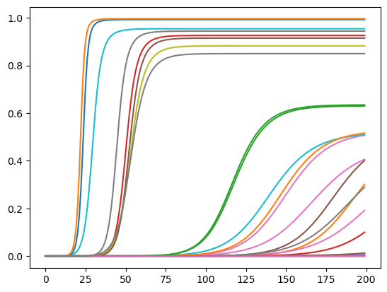
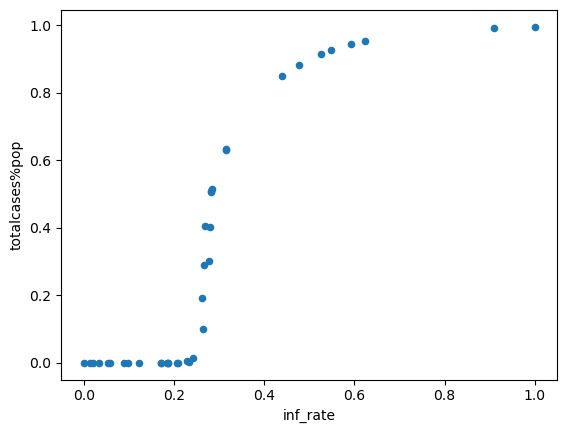

Installation
------------

conda install -c ioos geopandas=0.2.0.dev0
^^^^^^^^^^^^^^^^^^^^^^^^^^^^^^^^^^^^^^^^^^

Using SD to understand the SD Fever
-----------------------------------

A new emerging infectious disease in Europe, which does not spread to neighboring countries
~~~~~~~~~~~~~~~~~~~~~~~~~~~~~~~~~~~~~~~~~~~~~~~~~~~~~~~~~~~~~~~~~~~~~~~~~~~~~~~~~~~~~~~~~~~

In this script, we will use georeferenced data at a national level to
simulate a multiregional infectious disease model. We’ll then present
the advantages to project spatial data produced by our simulation back
on a map.

.. code:: python

    %matplotlib inline
    import pandas as pd
    import pysd

.. parsed-literal::

    /Users/houghton/anaconda/lib/python2.7/site-packages/pandas/computation/__init__.py:19: UserWarning: The installed version of numexpr 2.4.4 is not supported in pandas and will be not be used
    
      UserWarning)

A simple SIR model
~~~~~~~~~~~~~~~~~~

The model we’ll use to represent the dynamics of the disease is a simple
SIR model, with individuals aggregated into stocks by their health
condition S-Susceptible, I-Infectious, R-Recovered. We assume that the
complete population is susceptible, therefore the initial value of
susceptible stock is equal to the total population. In addition, we
built on the hypothesis that from now all infected person are reported.

.. code:: python

    from IPython.display import Image
    Image(filename='../../models/SD_Fever/SIR_model.png')

.. image:: Doing_more_with_spatialdata_multi_regional_SIR_Model_files/Doing_more_with_spatialdata_multi_regional_SIR_Model_4_0.png

In Vensim our model was parameterized with 1000 suceptible, 5 infectious
and 0 recovered individuals, a recovery period of 5 days and a contact
infectivity of 70%.

When we do not specificy anything else, the parameters and setting (e.g.
timestep, simulation time) from the Vensim model are used.

.. code:: python

    model = pysd.read_vensim('../../models/SD_Fever/SIR_Simple.mdl')
    result = model.run()
    result.plot();

Recap
=====

Modify parameter values
-----------------------

As we have seen before, we can specify changes to the parameters of the
model in the call to the run function. Here we set the contact
infectivity to 30% before running the simulation again. If you like, try
what happens when you change some of the other parameters.

.. code:: python

    result = model.run(params={ 'total_population':1000,
                                'contact_infectivity':.3, 
                                'recovery_period': 5
                              })
    result.plot();

Change Model settings
---------------------

We can also change in a very simpe manner the simulation time and
timestep of the model. An easy way to do it is to use numpy linspace
which returns evenly spaced numbers over a specified interval.

np.linspace(Start, Stop, Number of timestamps)

.. code:: python

    import numpy as np
    sim_time = 10
    np.linspace(0, sim_time, num=sim_time*4+1)

.. parsed-literal::

    array([  0.  ,   0.25,   0.5 ,   0.75,   1.  ,   1.25,   1.5 ,   1.75,
             2.  ,   2.25,   2.5 ,   2.75,   3.  ,   3.25,   3.5 ,   3.75,
             4.  ,   4.25,   4.5 ,   4.75,   5.  ,   5.25,   5.5 ,   5.75,
             6.  ,   6.25,   6.5 ,   6.75,   7.  ,   7.25,   7.5 ,   7.75,
             8.  ,   8.25,   8.5 ,   8.75,   9.  ,   9.25,   9.5 ,   9.75,  10.  ])

We can use the return\_timestamps keyword argument in PySD. This
argument expects a list of timestamps, and will return simulation
results at those timestamps.

.. code:: python

    model.run(return_timestamps=np.linspace(0, sim_time, num=sim_time*2+1))

.. raw:: html

    

    <table border="1" class="dataframe">
      <thead>
        <tr style="text-align: right;">
          <th></th>
          <th>cumulative cases</th>
          <th>infectious</th>
          <th>recovered</th>
          <th>susceptible</th>
        </tr>
      </thead>
      <tbody>
        <tr>
          <th>0.0</th>
          <td>0.000000</td>
          <td>5.000000</td>
          <td>0.000000</td>
          <td>1000.000000</td>
        </tr>
        <tr>
          <th>0.5</th>
          <td>0.750000</td>
          <td>5.250000</td>
          <td>0.500000</td>
          <td>999.250000</td>
        </tr>
        <tr>
          <th>1.0</th>
          <td>1.536909</td>
          <td>5.511909</td>
          <td>1.025000</td>
          <td>998.463091</td>
        </tr>
        <tr>
          <th>1.5</th>
          <td>2.362425</td>
          <td>5.786234</td>
          <td>1.576191</td>
          <td>997.637575</td>
        </tr>
        <tr>
          <th>2.0</th>
          <td>3.228310</td>
          <td>6.073495</td>
          <td>2.154814</td>
          <td>996.771690</td>
        </tr>
        <tr>
          <th>2.5</th>
          <td>4.136393</td>
          <td>6.374229</td>
          <td>2.762164</td>
          <td>995.863607</td>
        </tr>
        <tr>
          <th>3.0</th>
          <td>5.088572</td>
          <td>6.688986</td>
          <td>3.399587</td>
          <td>994.911428</td>
        </tr>
        <tr>
          <th>3.5</th>
          <td>6.086815</td>
          <td>7.018329</td>
          <td>4.068485</td>
          <td>993.913185</td>
        </tr>
        <tr>
          <th>4.0</th>
          <td>7.133156</td>
          <td>7.362838</td>
          <td>4.770318</td>
          <td>992.866844</td>
        </tr>
        <tr>
          <th>4.5</th>
          <td>8.229704</td>
          <td>7.723102</td>
          <td>5.506602</td>
          <td>991.770296</td>
        </tr>
        <tr>
          <th>5.0</th>
          <td>9.378635</td>
          <td>8.099723</td>
          <td>6.278912</td>
          <td>990.621365</td>
        </tr>
        <tr>
          <th>5.5</th>
          <td>10.582199</td>
          <td>8.493314</td>
          <td>7.088885</td>
          <td>989.417801</td>
        </tr>
        <tr>
          <th>6.0</th>
          <td>11.842715</td>
          <td>8.904499</td>
          <td>7.938216</td>
          <td>988.157285</td>
        </tr>
        <tr>
          <th>6.5</th>
          <td>13.162571</td>
          <td>9.333905</td>
          <td>8.828666</td>
          <td>986.837429</td>
        </tr>
        <tr>
          <th>7.0</th>
          <td>14.544228</td>
          <td>9.782172</td>
          <td>9.762056</td>
          <td>985.455772</td>
        </tr>
        <tr>
          <th>7.5</th>
          <td>15.990213</td>
          <td>10.249939</td>
          <td>10.740274</td>
          <td>984.009787</td>
        </tr>
        <tr>
          <th>8.0</th>
          <td>17.503119</td>
          <td>10.737852</td>
          <td>11.765268</td>
          <td>982.496881</td>
        </tr>
        <tr>
          <th>8.5</th>
          <td>19.085605</td>
          <td>11.246552</td>
          <td>12.839053</td>
          <td>980.914395</td>
        </tr>
        <tr>
          <th>9.0</th>
          <td>20.740391</td>
          <td>11.776683</td>
          <td>13.963708</td>
          <td>979.259609</td>
        </tr>
        <tr>
          <th>9.5</th>
          <td>22.470255</td>
          <td>12.328879</td>
          <td>15.141376</td>
          <td>977.529745</td>
        </tr>
        <tr>
          <th>10.0</th>
          <td>24.278032</td>
          <td>12.903768</td>
          <td>16.374264</td>
          <td>975.721968</td>
        </tr>
      </tbody>
    </table>
    

Multi-regional SIR Model
========================

Geographical Information
------------------------

Geospatial information as area on a map linked to several properties are
typically stored into shapefiles.

For this script, we will use geopandas library to manage the shapefiles,
and utilize its inherent plotting functionality.

.. code:: python

    import geopandas as gp
    
    shapefile = '../../data/SD_Fever/geo_df_EU.shp'
    geo_data = gp.GeoDataFrame.from_file(shapefile)
    geo_data.head(5)

::

    ---------------------------------------------------------------------------

    ImportError                               Traceback (most recent call last)

    <ipython-input-7-17f6f8f07da0> in <module>()
    ----> 1 import geopandas as gp
          2 
          3 shapefile = '../../data/SD_Fever/geo_df_EU.shp'
          4 geo_data = gp.GeoDataFrame.from_file(shapefile)
          5 geo_data.head(5)

    /Users/houghton/anaconda/lib/python2.7/site-packages/geopandas/__init__.pyc in <module>()
          2 from geopandas.geodataframe import GeoDataFrame
          3 
    ----> 4 from geopandas.io.file import read_file
          5 from geopandas.io.sql import read_postgis
          6 from geopandas.tools import sjoin

    /Users/houghton/anaconda/lib/python2.7/site-packages/geopandas/io/file.py in <module>()
          1 import os
          2 
    ----> 3 import fiona
          4 import numpy as np
          5 from shapely.geometry import mapping

    /Users/houghton/anaconda/lib/python2.7/site-packages/fiona/__init__.py in <module>()
         70 from six import string_types
         71 
    ---> 72 from fiona.collection import Collection, BytesCollection, vsi_path
         73 from fiona._drivers import driver_count, GDALEnv, supported_drivers
         74 from fiona.odict import OrderedDict

    /Users/houghton/anaconda/lib/python2.7/site-packages/fiona/collection.py in <module>()
          5 import sys
          6 
    ----> 7 from fiona.ogrext import Iterator, ItemsIterator, KeysIterator
          8 from fiona.ogrext import Session, WritingSession
          9 from fiona.ogrext import (

    ImportError: dlopen(/Users/houghton/anaconda/lib/python2.7/site-packages/fiona/ogrext.so, 2): Library not loaded: @rpath/libtiff.5.dylib
      Referenced from: /Users/houghton/anaconda/lib/libgdal.1.dylib
      Reason: Incompatible library version: libgdal.1.dylib requires version 8.0.0 or later, but libtiff.5.dylib provides version 7.0.0

Then we can project the geographic shape of the elements on a map.

.. code:: python

    import matplotlib.pyplot as plt
    
    geo_data.plot()
    plt.xlim([-28, 50])
    plt.ylim([30, 75])
    plt.show()

And plot on of the georeferenced property (e.g. population)

.. code:: python

    geo_data.plot(column='population', scheme='fisher_jenks', alpha=0.9, k=9, linewidth=0.1,
                 cmap=plt.cm.YlOrRd, legend=False)
    plt.xlim([-28, 50])
    plt.ylim([30, 75])
    plt.show()

::

    ---------------------------------------------------------------------------

    TypeError                                 Traceback (most recent call last)

    <ipython-input-9-c9605dc38e75> in <module>()
          1 geo_data.plot(column='population', scheme='fisher_jenks', alpha=0.9, k=9, linewidth=0.1,
    ----> 2              cmap=plt.cm.YlOrRd, legend=False)
          3 plt.xlim([-28, 50])
          4 plt.ylim([30, 75])
          5 plt.show()

    /Users/houghton/anaconda/lib/python2.7/site-packages/geopandas/geodataframe.pyc in plot(self, *args, **kwargs)
        379 
        380     def plot(self, *args, **kwargs):
    --> 381         return plot_dataframe(self, *args, **kwargs)
        382 
        383 def _dataframe_set_geometry(self, col, drop=False, inplace=False, crs=None):

    TypeError: plot_dataframe() got an unexpected keyword argument 'linewidth'

Run the model for each country
------------------------------

We want to run the core SD model for each country, with country specific
paramterization.

Thus, we formulate a function that based on each row parameterizes the
model with the value from geodata, performs the simulation and finally
returns the number of infectious individuals over time.

.. code:: python

    def runner(row):
        sim_time = 200
        params= {'total_population':row['population'],
                 'contact_infectivity' : row['inf_rate']}
        res = model.run(params=params,
                        return_timestamps=np.linspace(0, sim_time, num=sim_time*2+1))
        return res['infectious']

Apply function along rows of the Dataframe.
^^^^^^^^^^^^^^^^^^^^^^^^^^^^^^^^^^^^^^^^^^^

We want to apply the function row-wise (by country) therefore we set
axis to 1 (row) instead of default 0 (column). The result is a new
dataframe with the produced simulation for each country.

.. code:: python

    res = geo_data.apply(runner, axis=1)
    res.head()

.. raw:: html

    

    <table border="1" class="dataframe">
      <thead>
        <tr style="text-align: right;">
          <th></th>
          <th>0.0</th>
          <th>0.5</th>
          <th>1.0</th>
          <th>1.5</th>
          <th>2.0</th>
          <th>2.5</th>
          <th>3.0</th>
          <th>3.5</th>
          <th>4.0</th>
          <th>4.5</th>
          <th>...</th>
          <th>195.5</th>
          <th>196.0</th>
          <th>196.5</th>
          <th>197.0</th>
          <th>197.5</th>
          <th>198.0</th>
          <th>198.5</th>
          <th>199.0</th>
          <th>199.5</th>
          <th>200.0</th>
        </tr>
      </thead>
      <tbody>
        <tr>
          <th>0</th>
          <td>5.0</td>
          <td>5.407815</td>
          <td>5.848892</td>
          <td>6.325945</td>
          <td>6.841907</td>
          <td>7.399952</td>
          <td>8.003512</td>
          <td>8.656299</td>
          <td>9.362329</td>
          <td>10.125943</td>
          <td>...</td>
          <td>1.235898e+01</td>
          <td>1.174243e+01</td>
          <td>1.115664e+01</td>
          <td>1.060006e+01</td>
          <td>1.007126e+01</td>
          <td>9.568833e+00</td>
          <td>9.091472e+00</td>
          <td>8.637925e+00</td>
          <td>8.207004e+00</td>
          <td>7.797580e+00</td>
        </tr>
        <tr>
          <th>1</th>
          <td>5.0</td>
          <td>5.127795</td>
          <td>5.258857</td>
          <td>5.393268</td>
          <td>5.531115</td>
          <td>5.672485</td>
          <td>5.817468</td>
          <td>5.966157</td>
          <td>6.118646</td>
          <td>6.275032</td>
          <td>...</td>
          <td>7.391140e+04</td>
          <td>7.532471e+04</td>
          <td>7.675456e+04</td>
          <td>7.820069e+04</td>
          <td>7.966278e+04</td>
          <td>8.114054e+04</td>
          <td>8.263360e+04</td>
          <td>8.414161e+04</td>
          <td>8.566416e+04</td>
          <td>8.720083e+04</td>
        </tr>
        <tr>
          <th>2</th>
          <td>5.0</td>
          <td>6.939664</td>
          <td>9.631786</td>
          <td>13.368267</td>
          <td>18.554246</td>
          <td>25.752025</td>
          <td>35.742032</td>
          <td>49.607441</td>
          <td>68.851599</td>
          <td>95.561003</td>
          <td>...</td>
          <td>8.710440e-08</td>
          <td>7.927009e-08</td>
          <td>7.216718e-08</td>
          <td>6.579565e-08</td>
          <td>6.015551e-08</td>
          <td>5.514593e-08</td>
          <td>5.050006e-08</td>
          <td>4.620362e-08</td>
          <td>4.225663e-08</td>
          <td>3.865907e-08</td>
        </tr>
        <tr>
          <th>3</th>
          <td>5.0</td>
          <td>4.958609</td>
          <td>4.917560</td>
          <td>4.876852</td>
          <td>4.836480</td>
          <td>4.796443</td>
          <td>4.756736</td>
          <td>4.717359</td>
          <td>4.678307</td>
          <td>4.639579</td>
          <td>...</td>
          <td>1.937845e-01</td>
          <td>1.921802e-01</td>
          <td>1.905892e-01</td>
          <td>1.890113e-01</td>
          <td>1.874465e-01</td>
          <td>1.858947e-01</td>
          <td>1.843557e-01</td>
          <td>1.828294e-01</td>
          <td>1.813158e-01</td>
          <td>1.798147e-01</td>
        </tr>
        <tr>
          <th>4</th>
          <td>5.0</td>
          <td>5.130475</td>
          <td>5.264354</td>
          <td>5.401727</td>
          <td>5.542685</td>
          <td>5.687321</td>
          <td>5.835731</td>
          <td>5.988013</td>
          <td>6.144269</td>
          <td>6.304603</td>
          <td>...</td>
          <td>7.030861e+04</td>
          <td>7.130697e+04</td>
          <td>7.230348e+04</td>
          <td>7.329749e+04</td>
          <td>7.428830e+04</td>
          <td>7.527523e+04</td>
          <td>7.625757e+04</td>
          <td>7.723462e+04</td>
          <td>7.820564e+04</td>
          <td>7.916990e+04</td>
        </tr>
      </tbody>
    </table>
    
5 rows × 401 columns

    

Transpose simulation results for plotting
-----------------------------------------

The pandas line plot assumes that rows represent the timeseries and
columns the different objects. Since our data is not yet in this form,
we have to transpose the data. In pandas all we have to do is add an .T
at the end.

.. code:: python

    import pandas as pd
    df = pd.DataFrame(res).T

.. code:: python

    df.head(2)

.. raw:: html

    

    <table border="1" class="dataframe">
      <thead>
        <tr style="text-align: right;">
          <th></th>
          <th>0</th>
          <th>1</th>
          <th>2</th>
          <th>3</th>
          <th>4</th>
          <th>5</th>
          <th>6</th>
          <th>7</th>
          <th>8</th>
          <th>9</th>
          <th>...</th>
          <th>28</th>
          <th>29</th>
          <th>30</th>
          <th>31</th>
          <th>32</th>
          <th>33</th>
          <th>34</th>
          <th>35</th>
          <th>36</th>
          <th>37</th>
        </tr>
      </thead>
      <tbody>
        <tr>
          <th>0.0</th>
          <td>5.000000</td>
          <td>5.000000</td>
          <td>5.000000</td>
          <td>5.000000</td>
          <td>5.000000</td>
          <td>5.000000</td>
          <td>5.000000</td>
          <td>5.000000</td>
          <td>5.000000</td>
          <td>5.000000</td>
          <td>...</td>
          <td>5.000000</td>
          <td>5.000000</td>
          <td>5.000000</td>
          <td>5.000000</td>
          <td>5.000000</td>
          <td>5.000000</td>
          <td>5.000000</td>
          <td>5.000000</td>
          <td>5.000000</td>
          <td>5.000000</td>
        </tr>
        <tr>
          <th>0.5</th>
          <td>5.407815</td>
          <td>5.127795</td>
          <td>6.939664</td>
          <td>4.958609</td>
          <td>5.130475</td>
          <td>4.763649</td>
          <td>5.630614</td>
          <td>5.293347</td>
          <td>5.993628</td>
          <td>5.197358</td>
          <td>...</td>
          <td>7.459123</td>
          <td>4.550577</td>
          <td>5.240652</td>
          <td>5.364989</td>
          <td>5.125969</td>
          <td>5.169376</td>
          <td>5.245112</td>
          <td>5.205252</td>
          <td>4.595693</td>
          <td>4.976995</td>
        </tr>
      </tbody>
    </table>
    
2 rows × 38 columns

    

.. code:: python

    df.plot(legend=False);

Comparative Analysis
--------------------

Next lets try to compare how severe a country is hit by the SD fever.

Rather than looking at the number of infectious persons over time, a
better indicator for comparative analysis are the cumulative cases as
percentage of population in each country.

We can reuse our code from before but instead of returning the number of
infecious we return the cumulative cases.

.. code:: python

    def runner(row):
        sim_time = 200
        params= {'total_population':row['population'],
                 'contact_infectivity' : row['inf_rate']}
        res = model.run(params=params,
                        return_timestamps=range(0,sim_time))
        return res['cumulative_cases']
    
    #TIP: Ensure you are using lower case letters and the character _  not space

.. code:: python

    res = geo_data.apply(runner, axis=1)
    res.head()

.. raw:: html

    

    <table border="1" class="dataframe">
      <thead>
        <tr style="text-align: right;">
          <th></th>
          <th>0</th>
          <th>1</th>
          <th>2</th>
          <th>3</th>
          <th>4</th>
          <th>5</th>
          <th>6</th>
          <th>7</th>
          <th>8</th>
          <th>9</th>
          <th>...</th>
          <th>190</th>
          <th>191</th>
          <th>192</th>
          <th>193</th>
          <th>194</th>
          <th>195</th>
          <th>196</th>
          <th>197</th>
          <th>198</th>
          <th>199</th>
        </tr>
      </thead>
      <tbody>
        <tr>
          <th>0</th>
          <td>0.0</td>
          <td>1.931564</td>
          <td>4.191064</td>
          <td>6.834176</td>
          <td>9.926028</td>
          <td>13.542802</td>
          <td>17.773617</td>
          <td>22.722719</td>
          <td>28.512051</td>
          <td>35.284257</td>
          <td>...</td>
          <td>2.643414e+06</td>
          <td>2.643416e+06</td>
          <td>2.643418e+06</td>
          <td>2.643420e+06</td>
          <td>2.643421e+06</td>
          <td>2.643423e+06</td>
          <td>2.643424e+06</td>
          <td>2.643425e+06</td>
          <td>2.643426e+06</td>
          <td>2.643427e+06</td>
        </tr>
        <tr>
          <th>1</th>
          <td>0.0</td>
          <td>1.284525</td>
          <td>2.635551</td>
          <td>4.056522</td>
          <td>5.551057</td>
          <td>7.122967</td>
          <td>8.776255</td>
          <td>10.515136</td>
          <td>12.344040</td>
          <td>14.267628</td>
          <td>...</td>
          <td>3.207868e+05</td>
          <td>3.353914e+05</td>
          <td>3.505670e+05</td>
          <td>3.663273e+05</td>
          <td>3.826858e+05</td>
          <td>3.996553e+05</td>
          <td>4.172479e+05</td>
          <td>4.354754e+05</td>
          <td>4.543483e+05</td>
          <td>4.738766e+05</td>
        </tr>
        <tr>
          <th>2</th>
          <td>0.0</td>
          <td>6.044711</td>
          <td>17.688969</td>
          <td>40.119902</td>
          <td>83.329609</td>
          <td>166.565835</td>
          <td>326.904336</td>
          <td>635.757752</td>
          <td>1230.660685</td>
          <td>2376.436306</td>
          <td>...</td>
          <td>1.026049e+07</td>
          <td>1.026049e+07</td>
          <td>1.026049e+07</td>
          <td>1.026049e+07</td>
          <td>1.026049e+07</td>
          <td>1.026049e+07</td>
          <td>1.026049e+07</td>
          <td>1.026049e+07</td>
          <td>1.026049e+07</td>
          <td>1.026049e+07</td>
        </tr>
        <tr>
          <th>3</th>
          <td>0.0</td>
          <td>0.909294</td>
          <td>1.803595</td>
          <td>2.683151</td>
          <td>3.548204</td>
          <td>4.398995</td>
          <td>5.235758</td>
          <td>6.058724</td>
          <td>6.868121</td>
          <td>7.664172</td>
          <td>...</td>
          <td>5.280475e+01</td>
          <td>5.284336e+01</td>
          <td>5.288134e+01</td>
          <td>5.291870e+01</td>
          <td>5.295543e+01</td>
          <td>5.299156e+01</td>
          <td>5.302710e+01</td>
          <td>5.306205e+01</td>
          <td>5.309642e+01</td>
          <td>5.313023e+01</td>
        </tr>
        <tr>
          <th>4</th>
          <td>0.0</td>
          <td>1.290563</td>
          <td>2.649358</td>
          <td>4.079994</td>
          <td>5.586268</td>
          <td>7.172179</td>
          <td>8.841937</td>
          <td>10.599976</td>
          <td>12.450961</td>
          <td>14.399808</td>
          <td>...</td>
          <td>3.414903e+05</td>
          <td>3.555252e+05</td>
          <td>3.699699e+05</td>
          <td>3.848232e+05</td>
          <td>4.000827e+05</td>
          <td>4.157447e+05</td>
          <td>4.318042e+05</td>
          <td>4.482554e+05</td>
          <td>4.650906e+05</td>
          <td>4.823014e+05</td>
        </tr>
      </tbody>
    </table>
    
5 rows × 200 columns

    

Now, how do we get from the cumulative cases to the cumulative cases as % of the population?
~~~~~~~~~~~~~~~~~~~~~~~~~~~~~~~~~~~~~~~~~~~~~~~~~~~~~~~~~~~~~~~~~~~~~~~~~~~~~~~~~~~~~~~~~~~~

The answer is a simple matrix operation: divide row-wise the elements of
our computed values by the column of the original geo data set where we
had the population in each country.

Let's try to perform this type of operation on a minimal example.

.. code:: python

    # Create arbitrary column
    column = pd.Series([10, 0])
    column

.. parsed-literal::

    0    10
    1     0
    dtype: int64

.. code:: python

    # Create arbitrary pandas dataframe
    df = pd.DataFrame(np.random.randint(1,5,size=(2, 3)), columns=list('ABC'))
    df 

.. raw:: html

    

    <table border="1" class="dataframe">
      <thead>
        <tr style="text-align: right;">
          <th></th>
          <th>A</th>
          <th>B</th>
          <th>C</th>
        </tr>
      </thead>
      <tbody>
        <tr>
          <th>0</th>
          <td>1</td>
          <td>3</td>
          <td>3</td>
        </tr>
        <tr>
          <th>1</th>
          <td>1</td>
          <td>2</td>
          <td>4</td>
        </tr>
      </tbody>
    </table>
    

.. code:: python

    column*df

.. raw:: html

    

    <table border="1" class="dataframe">
      <thead>
        <tr style="text-align: right;">
          <th></th>
          <th>0</th>
          <th>1</th>
          <th>A</th>
          <th>B</th>
          <th>C</th>
        </tr>
      </thead>
      <tbody>
        <tr>
          <th>0</th>
          <td>NaN</td>
          <td>NaN</td>
          <td>NaN</td>
          <td>NaN</td>
          <td>NaN</td>
        </tr>
        <tr>
          <th>1</th>
          <td>NaN</td>
          <td>NaN</td>
          <td>NaN</td>
          <td>NaN</td>
          <td>NaN</td>
        </tr>
      </tbody>
    </table>
    

Now we can translate this operation on our actual problem.

.. code:: python

    res = pd.DataFrame(res.T/geo_data["population"])

.. code:: python

    res.plot(legend=False);

Analysis of results
-------------------

For example, we could study the impact of contact infectivity on the
cumulative cases at the end of the simulation

.. code:: python

    geo_data['totalcases%pop'] = res.loc[199] # Slice the final value at the end of the simulation
    df_scatter = pd.DataFrame(geo_data) # Geopandas dataframe to pandas Dataframe (geopandas tries to perform spatial analysis)
    df_scatter.plot.scatter(x='inf_rate', y='totalcases%pop'); # Plot infectivity versus cumulative cases at the end of the simulation

How Spatial Analysis Leads to Insight
-------------------------------------

Finally, we present slighltly advanced Python scripts to get our
simulation results projected on the map.

We merge the complete simulation results with our original georeferenced
information just as we did in the step before.

.. code:: python

    geo_data.head(2)

.. raw:: html

    

    <table border="1" class="dataframe">
      <thead>
        <tr style="text-align: right;">
          <th></th>
          <th>country</th>
          <th>geometry</th>
          <th>inf_rate</th>
          <th>population</th>
          <th>totalcases%pop</th>
        </tr>
      </thead>
      <tbody>
        <tr>
          <th>0</th>
          <td>Albania</td>
          <td>POLYGON ((20.59024743010491 41.85540416113361,...</td>
          <td>0.356814</td>
          <td>3639453.0</td>
          <td>0.726325</td>
        </tr>
        <tr>
          <th>1</th>
          <td>Austria</td>
          <td>POLYGON ((16.97966678230404 48.12349701597631,...</td>
          <td>0.250476</td>
          <td>8210281.0</td>
          <td>0.057717</td>
        </tr>
      </tbody>
    </table>
    

.. code:: python

    res.head(2)

.. raw:: html

    

    <table border="1" class="dataframe">
      <thead>
        <tr style="text-align: right;">
          <th></th>
          <th>0</th>
          <th>1</th>
          <th>2</th>
          <th>3</th>
          <th>4</th>
          <th>5</th>
          <th>6</th>
          <th>7</th>
          <th>8</th>
          <th>9</th>
          <th>...</th>
          <th>28</th>
          <th>29</th>
          <th>30</th>
          <th>31</th>
          <th>32</th>
          <th>33</th>
          <th>34</th>
          <th>35</th>
          <th>36</th>
          <th>37</th>
        </tr>
      </thead>
      <tbody>
        <tr>
          <th>0</th>
          <td>0.000000e+00</td>
          <td>0.000000e+00</td>
          <td>0.000000e+00</td>
          <td>0.000000e+00</td>
          <td>0.000000e+00</td>
          <td>0.000000e+00</td>
          <td>0.000000e+00</td>
          <td>0.000000e+00</td>
          <td>0.000000e+00</td>
          <td>0.000000e+00</td>
          <td>...</td>
          <td>0.000000e+00</td>
          <td>0.000000e+00</td>
          <td>0.000000e+00</td>
          <td>0.000000e+00</td>
          <td>0.000000e+00</td>
          <td>0.000000e+00</td>
          <td>0.000000e+00</td>
          <td>0.000000e+00</td>
          <td>0.000000e+00</td>
          <td>0.000000e+00</td>
        </tr>
        <tr>
          <th>1</th>
          <td>5.307292e-07</td>
          <td>1.564532e-07</td>
          <td>5.804221e-07</td>
          <td>1.262086e-07</td>
          <td>2.797414e-07</td>
          <td>5.094781e-08</td>
          <td>3.247481e-07</td>
          <td>1.628636e-07</td>
          <td>4.117605e-08</td>
          <td>2.622006e-07</td>
          <td>...</td>
          <td>4.582214e-07</td>
          <td>1.133618e-08</td>
          <td>4.005424e-08</td>
          <td>1.709489e-07</td>
          <td>5.763613e-08</td>
          <td>1.868129e-07</td>
          <td>2.840291e-07</td>
          <td>7.280583e-07</td>
          <td>1.592863e-08</td>
          <td>2.077661e-08</td>
        </tr>
      </tbody>
    </table>
    
2 rows × 38 columns

    

.. code:: python

    geo_data_merged = geo_data.merge(res.T, left_index=True, right_index=True)
    geo_data_merged.head()

.. raw:: html

    

    <table border="1" class="dataframe">
      <thead>
        <tr style="text-align: right;">
          <th></th>
          <th>country</th>
          <th>geometry</th>
          <th>inf_rate</th>
          <th>population</th>
          <th>totalcases%pop</th>
          <th>0</th>
          <th>1</th>
          <th>2</th>
          <th>3</th>
          <th>4</th>
          <th>...</th>
          <th>190</th>
          <th>191</th>
          <th>192</th>
          <th>193</th>
          <th>194</th>
          <th>195</th>
          <th>196</th>
          <th>197</th>
          <th>198</th>
          <th>199</th>
        </tr>
      </thead>
      <tbody>
        <tr>
          <th>0</th>
          <td>Albania</td>
          <td>POLYGON ((20.59024743010491 41.85540416113361,...</td>
          <td>0.356814</td>
          <td>3639453.0</td>
          <td>0.726325</td>
          <td>0.0</td>
          <td>5.307292e-07</td>
          <td>1.151564e-06</td>
          <td>1.877803e-06</td>
          <td>2.727341e-06</td>
          <td>...</td>
          <td>0.726322</td>
          <td>0.726322</td>
          <td>0.726323</td>
          <td>0.726323</td>
          <td>0.726324</td>
          <td>0.726324</td>
          <td>0.726324</td>
          <td>0.726325</td>
          <td>0.726325</td>
          <td>0.726325</td>
        </tr>
        <tr>
          <th>1</th>
          <td>Austria</td>
          <td>POLYGON ((16.97966678230404 48.12349701597631,...</td>
          <td>0.250476</td>
          <td>8210281.0</td>
          <td>0.057717</td>
          <td>0.0</td>
          <td>1.564532e-07</td>
          <td>3.210062e-07</td>
          <td>4.940783e-07</td>
          <td>6.761105e-07</td>
          <td>...</td>
          <td>0.039071</td>
          <td>0.040850</td>
          <td>0.042699</td>
          <td>0.044618</td>
          <td>0.046611</td>
          <td>0.048677</td>
          <td>0.050820</td>
          <td>0.053040</td>
          <td>0.055339</td>
          <td>0.057717</td>
        </tr>
        <tr>
          <th>2</th>
          <td>Belgium</td>
          <td>POLYGON ((3.314971144228537 51.34578095153609,...</td>
          <td>0.855631</td>
          <td>10414336.0</td>
          <td>0.985227</td>
          <td>0.0</td>
          <td>5.804221e-07</td>
          <td>1.698521e-06</td>
          <td>3.852373e-06</td>
          <td>8.001433e-06</td>
          <td>...</td>
          <td>0.985227</td>
          <td>0.985227</td>
          <td>0.985227</td>
          <td>0.985227</td>
          <td>0.985227</td>
          <td>0.985227</td>
          <td>0.985227</td>
          <td>0.985227</td>
          <td>0.985227</td>
          <td>0.985227</td>
        </tr>
        <tr>
          <th>3</th>
          <td>Bulgaria</td>
          <td>POLYGON ((22.65714969248299 44.23492300066128,...</td>
          <td>0.183375</td>
          <td>7204687.0</td>
          <td>0.000007</td>
          <td>0.0</td>
          <td>1.262086e-07</td>
          <td>2.503363e-07</td>
          <td>3.724174e-07</td>
          <td>4.924856e-07</td>
          <td>...</td>
          <td>0.000007</td>
          <td>0.000007</td>
          <td>0.000007</td>
          <td>0.000007</td>
          <td>0.000007</td>
          <td>0.000007</td>
          <td>0.000007</td>
          <td>0.000007</td>
          <td>0.000007</td>
          <td>0.000007</td>
        </tr>
        <tr>
          <th>4</th>
          <td>Bosnia and Herzegovina</td>
          <td>POLYGON ((19.00548628101012 44.86023366960916,...</td>
          <td>0.251521</td>
          <td>4613414.0</td>
          <td>0.104543</td>
          <td>0.0</td>
          <td>2.797414e-07</td>
          <td>5.742728e-07</td>
          <td>8.843763e-07</td>
          <td>1.210875e-06</td>
          <td>...</td>
          <td>0.074021</td>
          <td>0.077063</td>
          <td>0.080194</td>
          <td>0.083414</td>
          <td>0.086722</td>
          <td>0.090116</td>
          <td>0.093598</td>
          <td>0.097163</td>
          <td>0.100813</td>
          <td>0.104543</td>
        </tr>
      </tbody>
    </table>
    
5 rows × 205 columns

    

Plotting simulation results on map with Ipywidgets
--------------------------------------------------

Ipywidgets are interactive HTML widgets for IPython notebooks. Users
gain control of their data and can visualize changes in the data.

.. code:: python

    import matplotlib as mpl
    from ipywidgets import interact, FloatSlider, IntSlider,RadioButtons, Dropdown
    sim_time = 200
    slider_time = IntSlider(description = 'Time Select',
                            min=0, max=sim_time-1, value=1)

.. code:: python

    @interact( time = slider_time) # Scenario = select_scenario,
    def update_map(time): # Scenario
        ax = geo_data_merged.plot(column=time, scheme='fisher-jenks', alpha=0.9, k=9, linewidth=0.1,
                 cmap=plt.cm.Reds, legend=True,  figsize=(20, 30))
        plt.xlim(-28, 50)
        plt.ylim(30, 75)
        plt.xticks([])
        plt.yticks([])

.. parsed-literal::

    C:\Users\Schwarz\AppData\Local\Enthought\Canopy32\User\lib\site-packages\geopandas\geodataframe.py:447: UserWarning: Unrecognized scheme "fisher-jenks". Using "Quantiles" instead
      return plot_dataframe(self, *args, **kwargs)

.. image:: Doing_more_with_spatialdata_multi_regional_SIR_Model_files/Doing_more_with_spatialdata_multi_regional_SIR_Model_46_1.png

...

