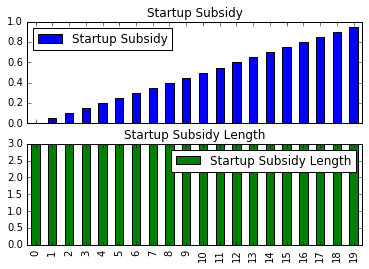
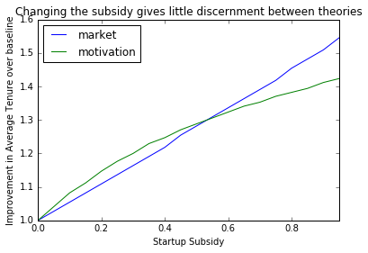
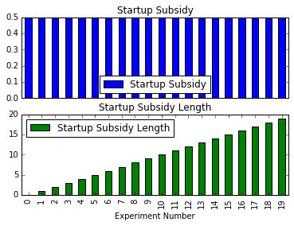

Designing Experiments
=====================

One of the tasks of an academic is to construct experiments that discern
which of a set of competing theories best explains reality. In some
sense, this task is the opposite to that of robust policy design. In
designing policy, we want to identify actions that give a favorable
result under any of the plausible system structures.

By contrast, in designing an experiment, we want to identify a policy
that gives as different a result as possible under various different
assumptions about system structure. Then by putting the policy into
place and observing the result, we have we have a clear signal as to
which policy is a better representation of the underlying system.

In this notebook, we'll explore using system dynamics modeling to help
design these experiments. For now, we'll just look at the system in a
deterministic fashion, to determine the general type of experiment that
we should conduct. This analysis would normally be followed with an
uncertainty analysis on parameters to identify how many samples would be
needed and to evaluate the statistical process to be followed on
experimental results.

In this example, we'll design a test between two competing theories of
how the tenure of an insurance company sales agent changes in response
to the various incentives they are given.

The first theory claims that agents' productivity is a function of their
motivation, and their motivation adjusts to reflect their level of
success.

A reinforcing loop is drawn in which more successful agents become more
motivated, perform better, and become yet more motivated; and vice
versa.

However, if agents motivation falls below a certain level, they choose
to leave to work somewhere else.

The second theory is more nuanced. In this theory, the agent
distinguishes between high payout clients, and low payout clients. In
order to have access to high payout clients, the agent must make sales
to low payout clients and get their referrals to their higher payout
friends.

Under this scenario, agents aren't earning a living making sales only to
low payout clients, and may leave if they are not able to gain access to
the market of high payout clients before they run out of savings.

The metric we are interested in observing is the 'tenure', or lifespan
of an agent. In trying to encourage agents to stay, managers might give
a subsidy to new agents to help them get started. We'll use the amount
and duration of this subsidy as our experimental levers.

.. code:: python

    %pylab inline
    import pysd
    import numpy as np
    import pandas as pd

.. parsed-literal::

    Populating the interactive namespace from numpy and matplotlib

.. parsed-literal::

    /Users/houghton/anaconda/lib/python2.7/site-packages/pandas/computation/__init__.py:19: UserWarning: The installed version of numexpr 2.4.4 is not supported in pandas and will be not be used
    
      UserWarning)

We begin by importing both of the models of behavior, giving them each a
different name. The first model which is driven by the agent's
motivation we'll call the ``motivation_model``; the second, which is
driven by the startup dynamics of the sales market, we'll term the
``market_model``.

.. code:: python

    motivation_model = pysd.read_vensim('../../models/Sales_Agents/Sales_Agent_Motivation_Dynamics.mdl')
    market_model = pysd.read_vensim('../../models/Sales_Agents/Sales_Agent_Market_Building_Dynamics.mdl')

To simplify things later on, we construct a function which takes a
particular policy set and applies it to each of the models, and formats
the output of the models. We'll use this function to evaluate the
performance of each of the models in the base case of no policy.

.. code:: python

    def runner(params):
        market = market_model.run(dict(params),return_columns=['Tenure'])
        motiv = motivation_model.run(dict(params),return_columns=['Tenure'])
        return pd.Series({'market':market['Tenure'].iloc[-1], 
                          'motivation':motiv['Tenure'].iloc[-1]})

As the models are not fully calibrated, they give different results in
the base case. What we will do in our analysis is to compare the changes
that result from various policies as a fraction of the base case.

.. code:: python

    base = runner({'Startup Subsidy': 0,
                  'Startup Subsidy Length': 0})
    base

.. parsed-literal::

    market         6.875
    motivation    10.625
    dtype: float64

The first test we'll make looks at the response to increasing the
startup subsidy for a fixed duration:

.. code:: python

    subsidy = pd.DataFrame(np.arange(0,1,.05), columns=['Startup Subsidy'])
    subsidy['Startup Subsidy Length'] = 3
    subsidy.plot(subplots=True, kind='bar');

We can now use our helper function to run the model for each of these
values of startup subsidy, and plot the result of each model. We see
that while the intervention does increase employee tenure with respect
to the baseline, it does so almost equally for the two models. While
this would be a good policy choice, it is not a good choice of
experimental manipulation, as we can't use the results of our experiment
to distinguish between the two options.

.. code:: python

    subsidy_res = subsidy.apply(runner, axis=1)/base

.. code:: python

    subsidy_res.index = subsidy['Startup Subsidy']
    subsidy_res.plot(style='o-')
    plt.ylabel('Improvement in Average Tenure over baseline')
    plt.title('Changing the subsidy gives little discernment between theories');

The next intervention we could make would be to use a fixed amount of
subsidy, but vary the length of time over which it is offered.

.. code:: python

    l_subsidy = pd.DataFrame(np.arange(0,12,1), 
                           columns=['Startup Subsidy Length'])
    l_subsidy['Startup Subsidy'] = .5
    l_subsidy.plot(subplots=True);

.. image:: Designing_Experiments_files/Designing_Experiments_20_0.png

.. code:: python

    l_subsidy = pd.DataFrame(index=range(20), 
                             data=0.5,
                             columns=['Startup Subsidy'])
    l_subsidy['Startup Subsidy Length'] = range(20)
    l_subsidy.plot(subplots=True, kind='bar')
    plt.xlabel('Experiment Number');

This intervention gives us more clear distinction between the two
models, with the market based model responding more strongly to the
intervention with longer subsidy lengths. In this case, we could use
this strategy and sample a number of points to see if we see the change
in the slope of the response curve or not.

.. code:: python

    l_subsidy_res = l_subsidy.apply(runner, axis=1)/base

.. code:: python

    l_subsidy_res.index = l_subsidy['Startup Subsidy Length']
    l_subsidy_res.plot(style='o-')
    plt.ylabel('Improvement in Average Tenure over baseline');
    plt.title('Changing the subsidy length gives more discernment at longer subsidization');

.. image:: Designing_Experiments_files/Designing_Experiments_24_0.png

A third intervention we could try would be to hold the total dollar
value given out in subsidies to an agent over time to be fixed, and vary
whether we give it out quickly or slowly.

.. code:: python

    total_subsidy = pd.DataFrame(np.arange(0.05,1,.05), 
                           columns=['Startup Subsidy'])
    total_subsidy['Startup Subsidy Length'] = 10/total_subsidy['Startup Subsidy']
    total_subsidy.plot(subplots=True, kind='bar');

.. image:: Designing_Experiments_files/Designing_Experiments_26_0.png

This third option turns out to be quite interesting. As we vary the rate
at which we give the startup subsidy, the curves resulting from the two
models move in qualitatively different directions. If we concieve of
agents using a startup subsidy to help pad their buffer until they can
get their client base established, then all of the impact comes from
having support until the high value clients begin to pay.

On the other hand, if we concieve of agents using the subsidy to support
their motivation, then they stay as long as they are making above
whatever threshold they have for dropping out.

.. code:: python

    total_subsidy_res = total_subsidy.apply(runner, axis=1)

.. code:: python

    total_subsidy_res.index = total_subsidy['Startup Subsidy']
    total_subsidy_res.plot(style='o-')
    plt.ylabel('Improvement in Average Tenure over baseline');

.. image:: Designing_Experiments_files/Designing_Experiments_29_0.png

We can conduct this experiment giving subsidies at slower rates to some
individuals, and faster rates to other individuals, and assess the
relative change in their behaviors, to assess which of our two models is
more representative of reality.
