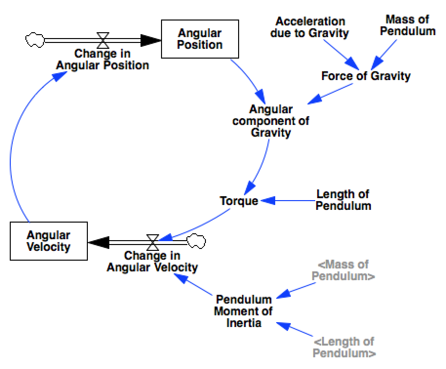
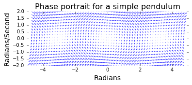

Phase Portraits
===============

In this notebook we'll look at how to generate `phase
portraits <https://en.wikipedia.org/wiki/Phase_portrait>`__. A phase
diagram shows the trajectories that a dynamical system can take through
its phase space. For any system that obeys the `markov
property <https://en.wikipedia.org/wiki/Markov_property>`__ we can
construct such a diagram, with one dimension for each of the system's
stocks.

Ingredients
-----------

Libraries
^^^^^^^^^

In this analysis we'll use:

-  **numpy** to create the grid of points that we'll sample over
-  **matplotlib** via ipython's pylab magic to construct the quiver plot

.. code:: python

    %pylab inline
    import pysd
    import numpy as np

.. parsed-literal::

    Populating the interactive namespace from numpy and matplotlib

Example Model
^^^^^^^^^^^^^

A single pendulum makes for a great example of oscillatory behavior. The
following model constructs equations of motion for the pendulum in
radial coordinates, simplifying the model from one constructed in
cartesian coordinates. In this model, the two state elements are the
angle of the pendulum and the derivative of that angle, its angular
velocity.

.. code:: python

    model = pysd.read_vensim('../../models/Pendulum/Single_Pendulum.mdl')

Recipe
------

Step 1: Define the range over which to plot
^^^^^^^^^^^^^^^^^^^^^^^^^^^^^^^^^^^^^^^^^^^

We've defined the angle :math:`0` to imply that the pendulum is hanging
straight down. To show the full range of motion, we'll show the angles
ragning from :math:`-1.5\pi` to :math:`+1.5\pi`, which will allow us to
see the the points of stable and unstable equilibrium.

We also want to sample over a range of angular velocities that are
reasonable for our system, for the given values of length and weight.

.. code:: python

    angular_position = np.linspace(-1.5*np.pi, 1.5*np.pi, 60)
    angular_velocity = np.linspace(-2, 2, 20)

Numpy's ``meshgrid`` lets us construct a 2d sample space based upon our
arrays

.. code:: python

    apv, avv = np.meshgrid(angular_position, angular_velocity)

Step 2: Calculate the state space derivatives at a point
^^^^^^^^^^^^^^^^^^^^^^^^^^^^^^^^^^^^^^^^^^^^^^^^^^^^^^^^

We'll define a helper function, which given a point in the state space,
will tell us what the derivatives of the state elements will be. One way
to do this is to run the model over a single timestep, and extract the
derivative information. In this case, the model's stocks have only one
inflow/outflow, so this is the derivative value.

As the derivative of the angular position is just the angular velocity,
whatever we pass in for the ``av`` parameter should be returned to us as
the derivative of ``ap``.

.. code:: python

    def derivatives(ap, av):
        ret = model.run(params={'angular_position':ap,
                                'angular_velocity':av}, 
                        return_timestamps=[0,1],
                        return_columns=['change_in_angular_position',
                                        'change_in_angular_velocity'])
    
        return tuple(ret.loc[0].values)
    
    derivatives(0,1)

.. parsed-literal::

    (1.0, -0.0)

Step 3: Calculate the state space derivatives across our sample space
^^^^^^^^^^^^^^^^^^^^^^^^^^^^^^^^^^^^^^^^^^^^^^^^^^^^^^^^^^^^^^^^^^^^^

We can use numpy's ``vectorize`` to make the function accept the 2d
sample space we have just created. Now we can generate the derivative of
angular position vector ``dapv`` and that of the angular velocity vector
``davv``. As before, the derivative of the angular posiiton should be
equal to the angular velocity. We check that the vectors are equal.

.. code:: python

    vderivatives = np.vectorize(derivatives)
    
    dapv, davv = vderivatives(apv, avv)
    (dapv == avv).all()

.. parsed-literal::

    True

Step 4: Plot the phase portrait
^^^^^^^^^^^^^^^^^^^^^^^^^^^^^^^

Now we have everything we need to draw the phase portrait. We'll use
matplotlib's ``quiver`` function, which wants as arguments the grid of x
and y coordinates, and the derivatives of these coordinates.

In the plot we see the locations of stable and unstable equilibria, and
can eyeball the trajectories that the system will take through the state
space by following the arrows.

.. code:: python

    plt.figure(figsize=(18,6))
    plt.quiver(apv, avv, dapv, davv, color='b', alpha=.75)
    plt.box('off')
    plt.xlim(-1.6*np.pi, 1.6*np.pi)
    plt.xlabel('Radians', fontsize=14)
    plt.ylabel('Radians/Second', fontsize=14)
    plt.title('Phase portrait for a simple pendulum', fontsize=16);

