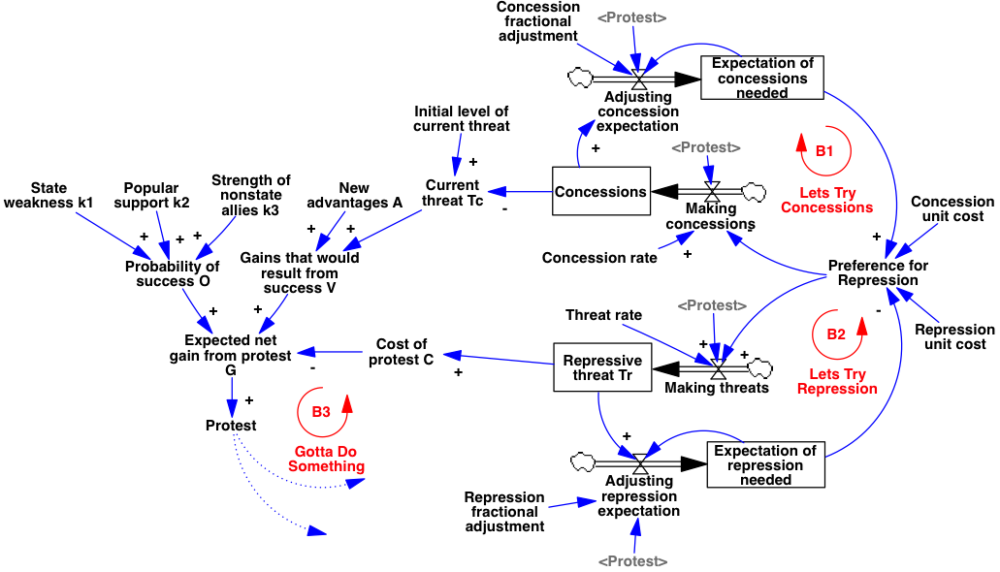
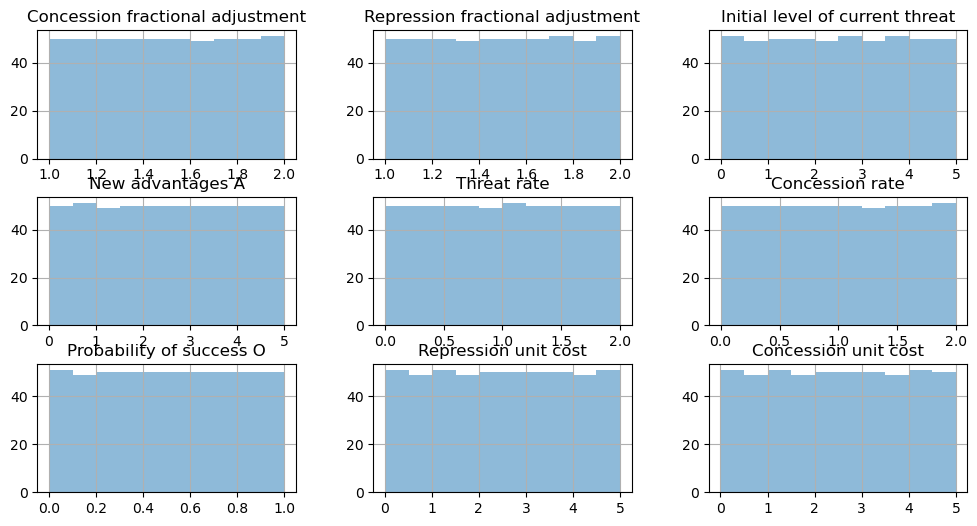

Formal Behavior Testing
=======================

Evaluating theory for dynamic consistency by formalizing statements
about system behavior

*James Houghton*

.. code:: ipython3

    %pylab inline
    import pyDOE
    import pandas as pd

.. parsed-literal::

    Populating the interactive namespace from numpy and matplotlib

The process of formalizing theory as a simulation model helps to
discipline a researcher’s effort, forcing them to be explicit in their
assumptions and logically consistent in their theory’s structure.
Similarly, the process of formalizing statements of system behavior with
respect to time or as a result of varying parameters promotes rigor in
claims of observable behavior of the system. The discipline of software
testing has lessons for how such behavioral tests are constructed and
provides a toolset for efficiently doing so. The approach has benefits
for those seeking to create their own theories, and to understand
theories promoted in existing literature.

Structural Consistency
~~~~~~~~~~~~~~~~~~~~~~

Are the statements of theory structure logically consistent with one
another? Are they ambiguous, missing pieces, or conflicting?

The process of modeling can be used as a personal discipline, enforcing
rigor in the understanding of a theory’s structure.

-  Make assumptions explicit
-  Enforce exhaustive structural communication
-  Identify system boundaries

“Formalization helps you to recognize vague concepts and resolve
contradictions. Formalization is where the real test of your
understanding occurs: computers accept no hand waving arguments.”

*Business Dynamics. Sterman 2000, 3.5.3*

Example of Formalizing Structural Statements
^^^^^^^^^^^^^^^^^^^^^^^^^^^^^^^^^^^^^^^^^^^^

“The value of achieving success [in a protest] depends on whether things
might be gained by action… this includes both new advantages and
avoiding harms that are currently experienced or anticipated”

*Threat (and Opportunity): Popular Action and State Response in the
Dynamics of Contentious Action. Goldstone and Tilly 2001*

**Interpretation:**

``Gains that would result from success = New Advantages + Harms Avoided``

   model diagram

Behavioral Consistency
~~~~~~~~~~~~~~~~~~~~~~

Does the theory’s structure actually **create the behavior** that is
described by the theory’s authors?

Two contexts: - Testing preconstructed theories against their assumed
implied behavior - Testing dynamic models during construction for
consistency with observed behavior

“I examine an existing theory in detail, formalizing it to investigate
how well the theory accounts for the phenomena it’s authors set out to
explain.”

*Problems and paradoxes in a model of punctuated organizational change.
Sastry 1997*

“The purpose of the model is… to play the roles of the actors in the
system and to trace out the consequences of their actions over time,
thus providing a test of the theory by checking whether the assumptions
can actually produce [asserted behavior].”

*The growth of knowledge: Testing a theory of scientific revolutions
with a formal model. Sterman 1985*

Lessons from software testing
^^^^^^^^^^^^^^^^^^^^^^^^^^^^^

We normally express statements of behavior as *‘Reference Modes’*, and
then manually compare reference modes to behavior.

We can learn from explicit behavioral testing in software development:

+---------------------------------+------------------------------------+
| Software Development            | SD Modeling                        |
+=================================+====================================+
| Make expected behavior of code  | Make statements of system behavior |
| explicit                        | explicit                           |
+---------------------------------+------------------------------------+
| Make developing software easier | Help with model formulation        |
+---------------------------------+------------------------------------+
| Ensure robustness to unknown    | Ensure robustness to uncertain     |
| user input                      | parameters                         |
+---------------------------------+------------------------------------+
| Support code acceptance by      | Create defensible statements of    |
| client                          | behavior                           |
+---------------------------------+------------------------------------+

“Testing is an extremely creative and intellectually challenging task.”

*The art of Software Testing - Myers et. al 2012*

A Software Testing Example
~~~~~~~~~~~~~~~~~~~~~~~~~~

.. code:: ipython3

    def test_step(self):
        """ Tests the PySD version of Vensim's `STEP` function """
        from pysd import functions  # What are we examining?
    
        functions.time = lambda: 5  # What are the conditions of our test?
        self.assertEqual(functions.step(1, 10), 0) # what is expected?
    
        functions.time = lambda: 15  # New conditions
        self.assertEqual(functions.step(1, 10), 1)  # New expectation
    
        functions.time = lambda: 10
        self.assertEqual(functions.step(1, 10), 1)

Example: Threat (and Opportunity): Popular Action and State Response in the Dynamics of Contentious Action
~~~~~~~~~~~~~~~~~~~~~~~~~~~~~~~~~~~~~~~~~~~~~~~~~~~~~~~~~~~~~~~~~~~~~~~~~~~~~~~~~~~~~~~~~~~~~~~~~~~~~~~~~~

Goldstone and Tilly 2001 |Goldstone Tilly Coding|

.. |Goldstone Tilly Coding| image:: Goldstone_Tilly_2001_Coding.png

.. code:: ipython3

    import pysd
    model = pysd.read_vensim("Goldstone_Tilly_2001.mdl")

.. code:: ipython3

    p_ranges = {
        'Concession fractional adjustment':(1,2),
        'Repression fractional adjustment':(1,2),
        'Initial level of current threat':(0,5),
        'New advantages A':(0,5),
        'Threat rate':(0,2),
        'Concession rate':(0,2),
        'Probability of success O':(0,1),
        'Repression unit cost':(0,5),
        'Concession unit cost':(0,5)
    }
    
    # Latin Hypercube Sample of Parameter Space
    norm_samples = pyDOE.lhs(n=len(p_ranges), samples=500)
    parameters = pd.DataFrame([{key:n*(p[1]-p[0])+p[0] for n,(key,p) 
                                in zip(row, p_ranges.items())} 
                               for row in norm_samples])

.. code:: ipython3

    parameters.hist(figsize=(12,6), layout=(3,3), 
                    histtype='stepfilled', alpha=.5);

Behavior Over Time Tests
~~~~~~~~~~~~~~~~~~~~~~~~

Within a single run of the model, assessing if the behavior of the
simulation actually follows that which is described by the authors:

**Claim:** “[The State] may **swing back and forth** between concessions
and repression, trying to find a combination that quells protest…” Pg.
188

**Interpretation:** In some cases, the regime may begin by primarily
working to increase either repression or concessions, such that the
instantaneous rate of ``Making concessions`` is greater (or less) than
that of ``Making threats`` and then at some point in the simulation,
**the relative weighting of these two parameters will switch**.

.. code:: ipython3

    def test(row):
        output = model.run(row.to_dict(), 
                           return_columns=['Making concessions','Making threats'])
        # is there a preference for making concessions at some point?
        repr_pref = output['Making concessions'] > output['Making threats']
        # is there a preference for making threats at some point?
        threat_pref = output['Making concessions'] < output['Making threats']
        # do both preferences occur at various points?
        return any(repr_pref) and any(threat_pref)
    
    result = parameters.apply(test, axis=1)
    print(any(result))

.. parsed-literal::

    True

Parametric Tests
~~~~~~~~~~~~~~~~

-  Testing comparisons of how the system would respond to various
   conditions.
-  Testing model behavior over a range of values for exogenous
   parameters.

**Claim:** Authoritarian states may … rachet up repression **too slowly
and insufficiently** to halt mobilization. Pg. 188

**Interpretation:** In some cases, slow implementation of repression may
fail to stop protests that would have been successfully repressed
through rapid application of the same absolute level of repression.

.. code:: ipython3

    def test(row):
        params = row.to_dict()
        repressive_threshold = np.NaN
        for threat_rate in np.linspace(*p_ranges['Threat rate'], num=10):  
            res = model.run(params.update({'Threat rate': threat_rate}),  
                            return_columns=['Protest', 
                                            'Repressive threat Tr']).iloc[0]
            if res['Protest'] == 0:  # protest is quelled
                if repressive_threshold is np.NaN:  # first successful
                    repressive_threshold = res['Repressive threat Tr']
                elif (res['Repressive threat Tr'] < repressive_threshold - .0001): 
                    return True  # higher rate succeeds over lower rate
        return False
    
    result = parameters.apply(test, axis=1)
    print(any(result))

Conclusions
-----------

-  The process of formalizing statements of system behavior with respect
   to time or as a result of varying parameters promotes rigor in claims
   of observable behavior of the system.
-  The field of software testing has lessons for how such behavioral
   tests are constructed and provides a toolset for efficiently doing
   so.
-  The approach has benefits for those seeking to create their own
   theories, and to understand theories promoted in existing literature.

If behavioral claims *are* consistent with theory:
~~~~~~~~~~~~~~~~~~~~~~~~~~~~~~~~~~~~~~~~~~~~~~~~~~

-  Your claims are stated in a defensible way

-or-

-  You have mastery of an important theory in your field

Todo: Look for new observable implications of the theory.

Behavioral claims *are not* consistent with theory:
~~~~~~~~~~~~~~~~~~~~~~~~~~~~~~~~~~~~~~~~~~~~~~~~~~~

-  You found a problem with your model before anyone else did

-or- - You found a problem with an important theory in your field

Todo: Fix the holes.

“We must design assessment into our work from the start so we can
discover errors more quickly”

*All models are wrong: Reflections on becoming a systems scientist.
Sterman 2002*

“Let every man test his own work. Then he will be proud of his own
work.”

*Biblical Letter from Paul of Tarsus to the Galatians. c50 AD. ch.6 v.4*
